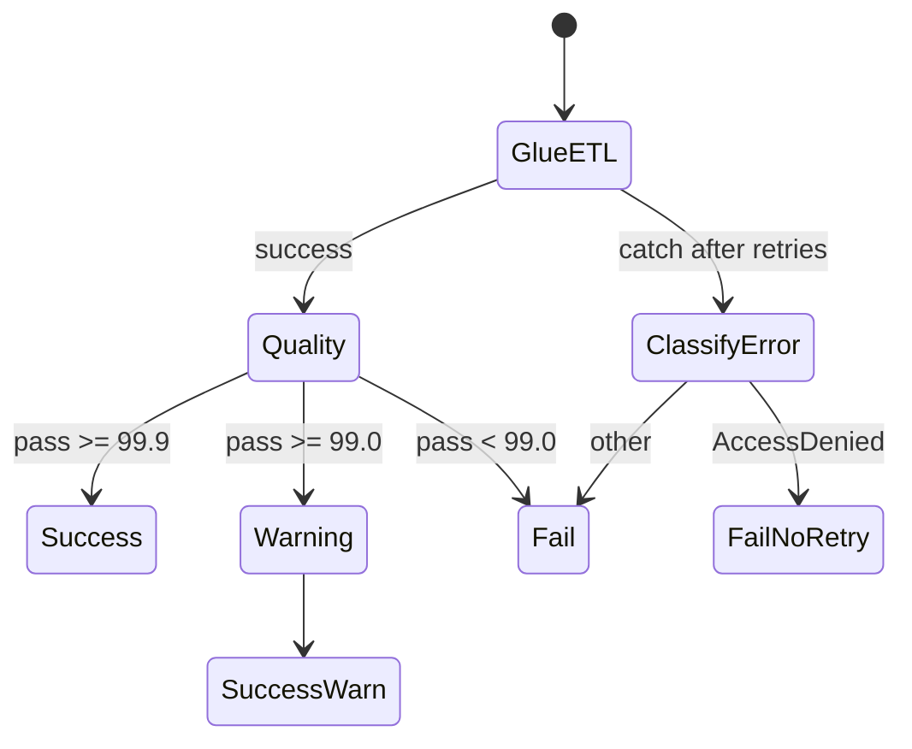

# Lab 6.2: Retry Automation and Error Branching

> 📊 **Diagrams:** [Mermaid](diagram.md) · [Draw.io (lab-6.2-retry-error-branching.drawio)](../../../../docs/diagrams/drawio/lab-6.2-retry-error-branching.drawio) · [PNG](../../../../docs/diagrams/png/lab-6.2-retry-error-branching.png) · [SVG](../../../../docs/diagrams/svg/lab-6.2-retry-error-branching.svg)

**Estimated time:** 90 minutes · **Module 6**

---

## Objectives

- Add Retry blocks with exponential backoff and jitter for Glue and Lambda
- Implement Catch handlers that preserve error context in `$.error`
- Branch with Choice states: success, warning (degraded SLO), hard failure
- Classify non-retriable errors (AccessDenied) vs transient throttling
- Document retry budget and operational expectations

---

## Prerequisites

- Lab 6.1 complete (Lambda, Glue, base state machine)
- Understanding of Module 4 quality SLO thresholds (99.9% / 99.0%)

---

## Architecture



---

## Project Structure

```text
lab-6.2-retry-error-branching/
├── README.md
└── src/
    └── daily_etl_with_retry.asl.json
```

---

## Step 1: Review Retry Configuration

Open `src/daily_etl_with_retry.asl.json`. Note:

| State | MaxAttempts | BackoffRate | Errors Retried |
|-------|-------------|-------------|----------------|
| StartGlueETL | 3 | 2.0 | TaskFailed, Throttling, ConcurrentRuns |
| RunQualityCheck | 2 | 2.0 | Lambda service errors |

**Exercise:** Add `States.Timeout` to Retry with `MaxAttempts: 1`.

---

## Step 2: Deploy Updated State Machine

```bash
export GLUE_JOB_NAME=cnde-dev-raw-to-cleaned-etl
export VALIDATION_LAMBDA_ARN=arn:aws:lambda:us-east-1:ACCOUNT:function:cnde-dev-pipeline-validation

sed -e "s|\${GLUE_JOB_NAME}|${GLUE_JOB_NAME}|g" \
    -e "s|\${VALIDATION_LAMBDA_ARN}|${VALIDATION_LAMBDA_ARN}|g" \
    src/daily_etl_with_retry.asl.json > build/daily_etl_with_retry-resolved.json

aws stepfunctions update-state-machine \
  --state-machine-arn "$STATE_MACHINE_ARN" \
  --definition file://build/daily_etl_with_retry-resolved.json
```

---

## Step 3: Test Transient Failure (Simulated)

**Option A — Throttling:** Set Glue `max_concurrent_runs` to 1 and start two executions simultaneously.

**Option B — Mock:** Temporarily change Glue job name to invalid value, observe retries in execution history, then restore.

Record in `LAB-REPORT.md`:

| Attempt | Timestamp | Error | Next action |
|---------|-----------|-------|-------------|
| 1 | | | Retry |
| 2 | | | Retry |
| 3 | | | Catch → ClassifyError |

---

## Step 4: Test Warning Path

Start execution with quality pass rate 99.5%:

```bash
aws stepfunctions start-execution \
  --state-machine-arn "$STATE_MACHINE_ARN" \
  --name "lab62-warning-$(date +%s)" \
  --input '{"processing_date":"2024-01-15","dataset":"retail/orders","mock_pass_rate":99.5}'
```

**Verification:** Final status `SUCCEEDED` via `PipelineSucceededWithWarning`; `$.warning` populated.

---

## Step 5: Test Non-Retriable Error

Use invalid Lambda ARN or deny `glue:StartJobRun` in IAM policy. Confirm `ClassifyError` → `FailNoRetry` without exhausting business-logic retries.

---

## Deliverables

- [ ] Updated ASL deployed
- [ ] Retry attempt captured in execution event history
- [ ] Warning path execution documented
- [ ] `LAB-REPORT.md` with retry policy table and classification rules

---

## Verification Checklist

- [ ] Glue state shows `Retry` events before `Catch` on transient errors
- [ ] pass_rate 99.5% reaches `QuarantineReview`, not `NotifyFailure`
- [ ] pass_rate 98.0% reaches `NotifyFailure`
- [ ] AccessDenied skips further retries (immediate `FailNoRetry`)

---

## Troubleshooting

| Issue | Solution |
|-------|----------|
| No Retry events visible | Error type not in `ErrorEquals` list — add exact error name |
| Infinite-looking retries | MaxAttempts too high; check execution timeout (1 year max) |
| Warning path never hit | Lambda returns integer not float for pass_rate |
| StringMatches not matching | Error field is object — use `$.error.Cause` |
| JitterStrategy unsupported | Remove if using older Step Functions feature set |

---

## What You Learned

- Retry is for **transient** infrastructure failures, not bad data
- Catch + Choice implements operational triage paths
- Degraded SLO (warning) differs from hard pipeline failure
- Classify errors to avoid pointless automated retries

---

**Next:** [Lab 6.3 – SNS Failure Handling](../lab-6.3-sns-failure-handling/README.md)
