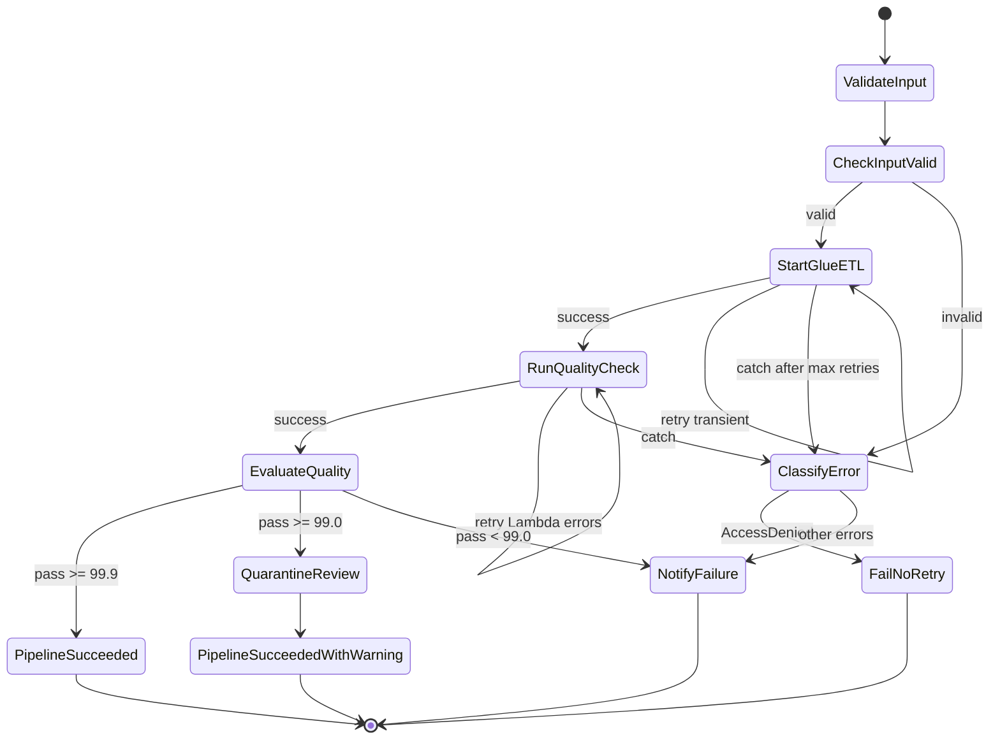
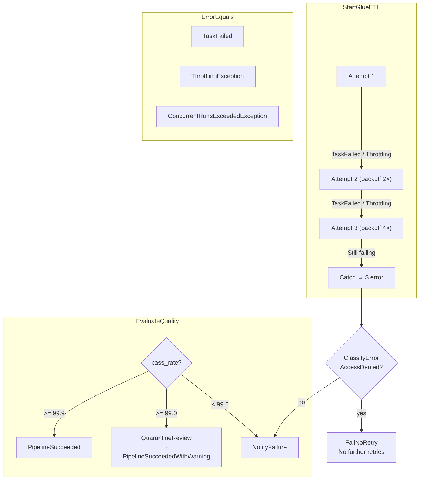
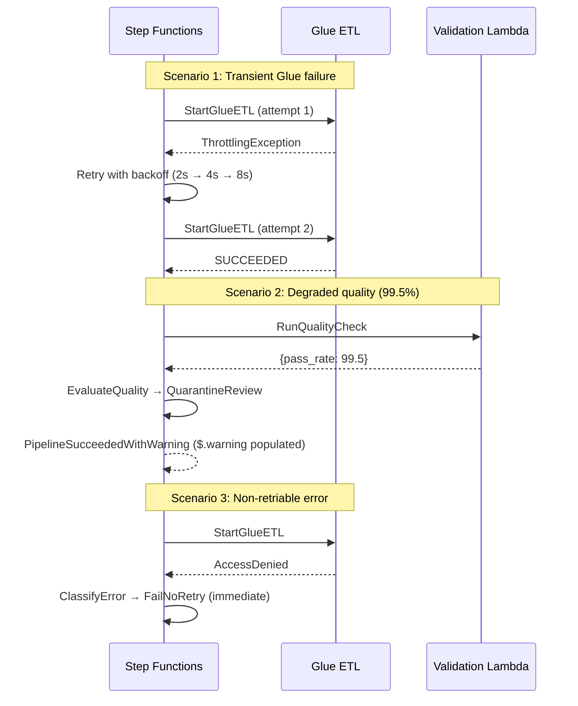

# Lab 6.2: Retry Automation and Error Branching — Architecture Diagram

## Purpose

Extend the Lab 6.1 Step Functions pipeline with **Retry** blocks (exponential backoff + jitter) for transient Glue and Lambda failures, **Catch** handlers that preserve error context in `$.error`, and **Choice** states that implement three outcomes: full success (≥ 99.9%), degraded warning (≥ 99.0%), and hard failure (< 99.0%). Classify non-retriable errors (e.g., `AccessDenied`) to avoid pointless automated retries.

---

## State Machine Architecture



---

## Retry & Catch Flow



---

## Execution Scenarios



---

## Key Components

| Component | Location | Role |
|-----------|----------|------|
| `daily_etl_with_retry.asl.json` | `src/` | Extended state machine with Retry, Catch, Choice |
| `StartGlueETL` Retry | ASL block | MaxAttempts: 3, BackoffRate: 2.0, JitterStrategy |
| `RunQualityCheck` Retry | ASL block | MaxAttempts: 2 for Lambda service errors |
| `ClassifyError` | Choice state | Routes `AccessDenied` to `FailNoRetry` |
| `EvaluateQuality` | Choice state | Three-tier SLO: 99.9% / 99.0% / fail |
| `QuarantineReview` | Pass state | Warning path; triggers steward review |
| `PipelineSucceededWithWarning` | Succeed state | Degraded SLO; `$.warning` in output |
| `FailNoRetry` | Fail state | Non-retriable IAM/permission errors |

---

## S3 Paths & Data Flow

| Scenario | S3 Impact | Pipeline Outcome |
|----------|-----------|------------------|
| Glue retry succeeds | `cleaned/retail/orders/` written after retry | `PipelineSucceeded` |
| pass_rate 99.5% | Quarantine may have records; cleaned partially written | `PipelineSucceededWithWarning` |
| pass_rate 98.0% | Quarantine populated; curated publish blocked | `NotifyFailure` |
| AccessDenied on Glue | No S3 writes | `FailNoRetry` (immediate) |

### Retry Policy Table

| State | MaxAttempts | BackoffRate | IntervalSeconds | Errors Retried |
|-------|-------------|-------------|-----------------|----------------|
| `StartGlueETL` | 3 | 2.0 | 2 | `TaskFailed`, `ThrottlingException`, `ConcurrentRunsExceededException` |
| `RunQualityCheck` | 2 | 2.0 | 1 | Lambda service errors |

### SLO Thresholds

| Pass Rate | State Transition | Business Meaning |
|-----------|-----------------|------------------|
| ≥ 99.9% | `PipelineSucceeded` | Full success; publish curated |
| ≥ 99.0% | `QuarantineReview` → `PipelineSucceededWithWarning` | Degraded; steward review required |
| < 99.0% | `NotifyFailure` | Hard failure; block downstream |

### Data Flow Summary

```text
StartGlueETL
      ├── success ──► RunQualityCheck ──► EvaluateQuality
      │                                      ├── >= 99.9% ──► SUCCEED
      │                                      ├── >= 99.0% ──► WARNING (quarantine review)
      │                                      └── < 99.0%  ──► FAIL
      │
      ├── retry (transient) ──► up to 3 attempts with backoff
      │
      └── catch ──► ClassifyError
                        ├── AccessDenied ──► FailNoRetry
                        └── other ──► NotifyFailure
```

---

## Related Labs

- **Previous:** [Lab 6.1 – Step Functions ETL](../lab-6.1-step-functions-etl/diagram.md)
- **Next:** [Lab 6.3 – SNS Failure Handling](../lab-6.3-sns-failure-handling/diagram.md)
