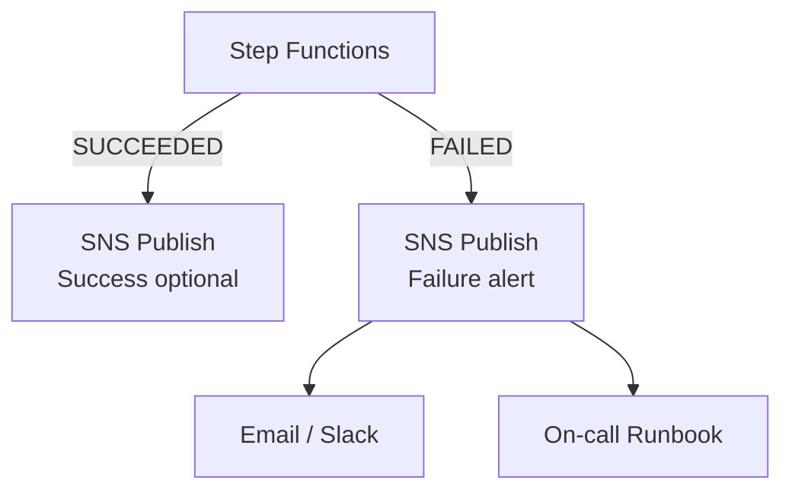

# Lab 6.3: Failure Handling with SNS Notifications

> 📊 **Diagrams:** [Mermaid](diagram.md) · [Draw.io (lab-6.3-sns-failure-handling.drawio)](../../../../docs/diagrams/drawio/lab-6.3-sns-failure-handling.drawio) · [PNG](../../../../docs/diagrams/png/lab-6.3-sns-failure-handling.png) · [SVG](../../../../docs/diagrams/svg/lab-6.3-sns-failure-handling.svg)

**Estimated time:** 90 minutes · **Module 6**

---

## Objectives

- Create SNS topic and email subscription for pipeline alerts
- Publish structured success and failure messages from Step Functions
- Wire SNS into Terraform step-functions module
- Write an operational runbook for on-call response
- Verify end-to-end alert delivery on simulated failure

---

## Prerequisites

- Labs 6.1 and 6.2 complete
- Email address for SNS subscription confirmation

---

## Architecture



---

## Project Structure

```text
lab-6.3-sns-failure-handling/
├── README.md
├── RUNBOOK.md          (you create)
└── src/
    └── daily_etl_with_sns.asl.json
```

---

## Step 1: Create SNS Topic

```bash
export TOPIC_ARN=$(aws sns create-topic --name cnde-dev-pipeline-alerts --query TopicArn --output text)
aws sns subscribe \
  --topic-arn "$TOPIC_ARN" \
  --protocol email \
  --notification-endpoint your-email@example.com
```

Confirm subscription via email link before testing.

**Verification:**

```bash
aws sns list-subscriptions-by-topic --topic-arn "$TOPIC_ARN"
```

---

## Step 2: Update Step Functions IAM Role

Ensure execution role includes:

```json
{
  "Effect": "Allow",
  "Action": "sns:Publish",
  "Resource": "arn:aws:sns:us-east-1:ACCOUNT_ID:cnde-dev-pipeline-alerts"
}
```

Terraform module sets this when `sns_topic_arn` is provided.

---

## Step 3: Deploy SNS-Enabled State Machine

```bash
export GLUE_JOB_NAME=cnde-dev-raw-to-cleaned-etl
export VALIDATION_LAMBDA_ARN=arn:aws:lambda:us-east-1:ACCOUNT:function:cnde-dev-pipeline-validation
export SNS_TOPIC_ARN="$TOPIC_ARN"

sed -e "s|\${GLUE_JOB_NAME}|${GLUE_JOB_NAME}|g" \
    -e "s|\${VALIDATION_LAMBDA_ARN}|${VALIDATION_LAMBDA_ARN}|g" \
    -e "s|\${SNS_TOPIC_ARN}|${SNS_TOPIC_ARN}|g" \
    src/daily_etl_with_sns.asl.json > build/daily_etl_with_sns-resolved.json

aws stepfunctions update-state-machine \
  --state-machine-arn "$STATE_MACHINE_ARN" \
  --definition file://build/daily_etl_with_sns-resolved.json
```

---

## Step 4: Trigger Failure Notification

```bash
aws stepfunctions start-execution \
  --state-machine-arn "$STATE_MACHINE_ARN" \
  --name "lab63-fail-$(date +%s)" \
  --input '{"processing_date":"2024-01-15","dataset":"retail/orders","mock_pass_rate":95.0}'
```

**Verification:**

- Email subject: `[RetailCo] Daily ETL FAILED`
- Body contains `processing_date`, `pass_rate`, `execution_id`
- Step Functions graph shows `NotifyFailure` → `PipelineFailed`

---

## Step 5: Trigger Success Notification (Optional)

```bash
aws stepfunctions start-execution \
  --state-machine-arn "$STATE_MACHINE_ARN" \
  --name "lab63-ok-$(date +%s)" \
  --input '{"processing_date":"2024-01-15","dataset":"retail/orders","mock_pass_rate":99.95}'
```

---

## Step 6: Write Operational Runbook

Create `RUNBOOK.md`:

```markdown
# RetailCo Daily ETL — On-Call Runbook

## Alert: Daily ETL FAILED

### 1. Triage (5 min)
- Open Step Functions execution by execution_id in SNS body
- Identify failed state: Glue vs Quality vs SNS

### 2. Common Causes
| Failed State | Action |
|--------------|--------|
| StartGlueETL | Check Glue logs; replay partition |
| RunQualityCheck | Review quarantine in S3 |
| EvaluateQuality | Steward review; do not publish curated |

### 3. Recovery
- Fix root cause → re-run with same processing_date
- Document in metadata/pipeline-runs/

### 4. Escalation
- Finance impact → page data platform lead
```

---

## Deliverables

- [ ] SNS topic with confirmed subscription
- [ ] Failure email received and screenshot in `LAB-REPORT.md`
- [ ] `RUNBOOK.md` completed
- [ ] Terraform module updated with `sns_topic_arn` (if using IaC)

---

## Troubleshooting

| Issue | Solution |
|-------|----------|
| No email received | Confirm SNS subscription; check spam |
| `sns:Publish` AccessDenied | Update SFN execution role |
| Empty message body | Verify `States.JsonToString($.notification)` |
| Success spam | Disable success path in prod; failures only |
| PHI in message | Strip payload fields in `PrepareFailureNotification` (Module 7) |

---

## What You Learned

- Operational pipelines require human-visible failure signals
- Structured SNS JSON enables Slack/Lambda fan-out later
- Runbooks link automated alerts to concrete recovery steps
- Success notifications are optional; failures are mandatory

---

**Next:** [Assignment 6](../../assignments/assignment-06.md)
