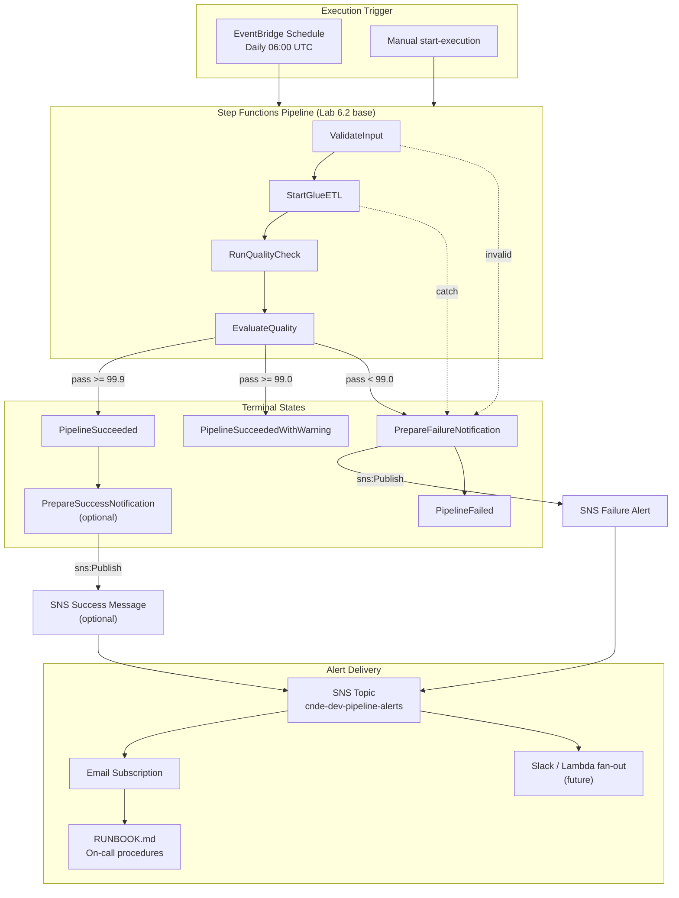
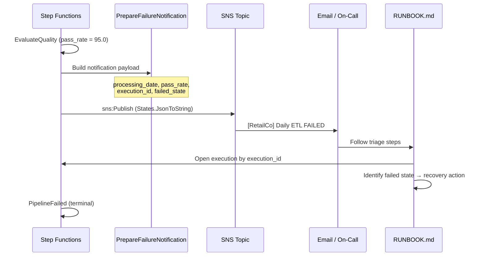
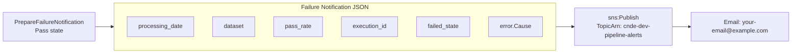

# Lab 6.3: Failure Handling with SNS Notifications — Architecture Diagram

## Purpose

Add operational visibility to the Lab 6.2 pipeline by publishing structured **SNS** notifications on pipeline failure (and optionally success). Create an SNS topic with email subscription, wire `sns:Publish` tasks into the Step Functions state machine, and document an on-call runbook linking automated alerts to concrete recovery steps for the RetailCo daily ETL.

---

## Architecture Overview



---

## Failure Notification Sequence



---

## SNS Message Structure



---

## Key Components

| Component | Service | Role |
|-----------|---------|------|
| `daily_etl_with_sns.asl.json` | Step Functions | ASL with `PrepareFailureNotification` + `sns:Publish` tasks |
| `cnde-dev-pipeline-alerts` | SNS Topic | Central alert fan-out for pipeline events |
| Email subscription | SNS | Confirmed endpoint for on-call notifications |
| `PrepareFailureNotification` | Pass state | Builds structured JSON message from execution context |
| `NotifyFailureSNS` | Task (sns:Publish) | Publishes failure alert before terminal Fail |
| `PrepareSuccessNotification` | Pass state | Optional success message (disable in prod) |
| `RUNBOOK.md` | Documentation | Triage, common causes, recovery, escalation |
| Terraform module | IaC | `sns_topic_arn` parameter adds `sns:Publish` to execution role |

---

## S3 Paths & Data Flow

| Failed State | S3 Investigation Path | Runbook Action |
|--------------|----------------------|----------------|
| `StartGlueETL` | Glue logs; `raw/retail/orders/` | Check Glue job logs; replay partition |
| `RunQualityCheck` | `quarantine/retail/orders/` | Review quarantined records |
| `EvaluateQuality` | `metadata/quality-reports/` | Steward review; block curated publish |
| Recovery | `metadata/pipeline-runs/` | Document re-run with same `processing_date` |

### SNS Message Fields

| Field | Source | Purpose |
|-------|--------|---------|
| `processing_date` | `$.processing_date` | Identify affected data partition |
| `dataset` | `$.dataset` | Scope of failure (e.g., `retail/orders`) |
| `pass_rate` | `$.quality_result.Payload.pass_rate` | Quality SLO context |
| `execution_id` | `$$.Execution.Id` | Direct link to Step Functions console |
| `failed_state` | `$.error` or last state name | Triage starting point |

### Alert Flow Summary

```text
Pipeline failure (quality, Glue, input)
      │
      ▼
PrepareFailureNotification
      │  build JSON: {processing_date, pass_rate, execution_id, ...}
      ▼
sns:Publish → cnde-dev-pipeline-alerts
      │
      ├──► Email: [RetailCo] Daily ETL FAILED
      │
      └──► On-call → RUNBOOK.md
              ├── 1. Triage (5 min) — open execution by ID
              ├── 2. Common causes table
              ├── 3. Recovery — fix + re-run processing_date
              └── 4. Escalation — finance impact → platform lead
```

### IAM Addition

```json
{
  "Effect": "Allow",
  "Action": "sns:Publish",
  "Resource": "arn:aws:sns:us-east-1:{account}:cnde-dev-pipeline-alerts"
}
```

### Test Scenarios

| Input | Expected Alert | Final Status |
|-------|---------------|--------------|
| `mock_pass_rate: 95.0` | Failure email with pass_rate | `PipelineFailed` |
| `mock_pass_rate: 99.95` | Optional success email | `PipelineSucceeded` |

---

## Related Labs

- **Previous:** [Lab 6.2 – Retry and Error Branching](../lab-6.2-retry-error-branching/diagram.md)
- **Next:** Assignment 6 – Orchestration Capstone
