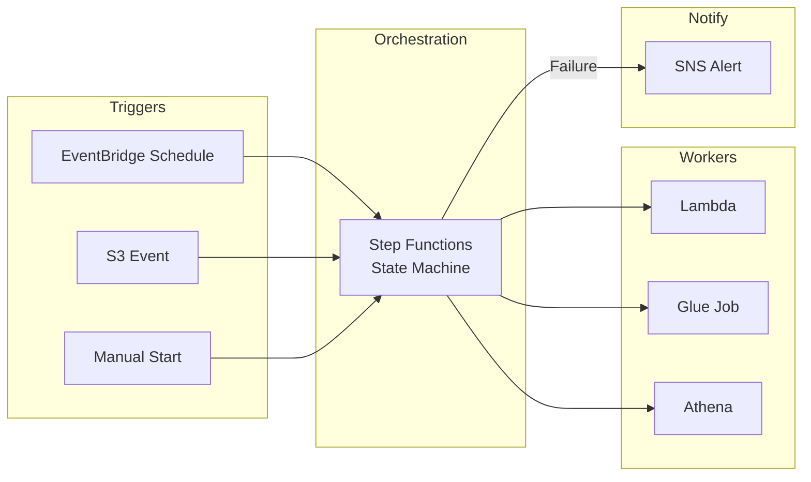
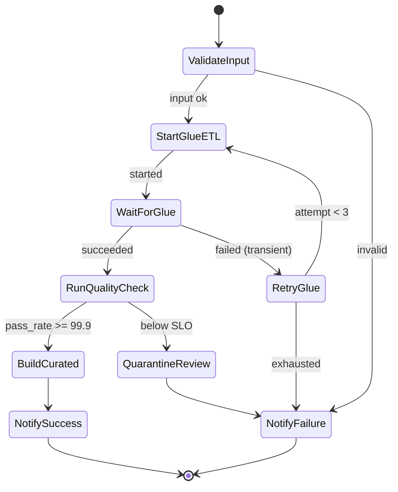

# Week 6 Lecture: Orchestration & Workflow Automation

**Duration:** 2 hours · **Module 6**

---

## Learning Objectives

By the end of this lecture you will:

1. Design multi-stage ETL workflows with AWS Step Functions
2. Implement scheduling, dependencies, and parallel branches across Glue and Lambda
3. Configure retry policies, error branching, and catch handlers
4. Build failure recovery patterns with SNS notifications and operational runbooks
5. Orchestrate the pipelines built in Modules 2–5 into a cohesive daily batch

---

## 1. Why Orchestration?

Individual Lambda and Glue jobs from Modules 2–4 work in isolation. Production platforms need **coordinated execution**:

- Run Glue ETL only after raw files land
- Run quality validation before curated SQL loads (Module 5)
- Stop downstream steps when upstream fails
- Retry transient failures without manual intervention
- Notify on-call engineers when SLOs are at risk

**Step Functions** provides visual and JSON-defined state machines with built-in error handling, exactly-once semantics for task tokens, and integration with 220+ AWS services.



---

## 2. Step Functions Core Concepts

### States

| State Type | Purpose | Example |
|------------|---------|---------|
| **Task** | Invoke a service | `glue:startJobRun`, `lambda:invoke` |
| **Choice** | Branch on condition | Check `$.quality.pass_rate` |
| **Parallel** | Concurrent branches | Crawl + metrics in parallel |
| **Wait** | Delay | Backoff before retry |
| **Pass** | Transform input | Add default fields |
| **Succeed / Fail** | Terminal | End with error code |
| **Map** | Iterate array | Process multiple datasets |

### Execution Input/Output

Step Functions passes **JSON payloads** between states using JSONPath:

```json
{
  "processing_date": "2024-01-15",
  "dataset": "retail/orders",
  "quality": { "pass_rate": 99.2, "within_slo": false }
}
```

Reference in ASL: `$.processing_date`, `$.quality.pass_rate`.

### Standard vs Express Workflows

| Type | Duration | Cost Model | Use Case |
|------|----------|------------|----------|
| **Standard** | Up to 1 year | Per state transition | ETL batches, human approval |
| **Express** | Up to 5 minutes | Per execution + duration | High-volume streaming fan-out |

**This module** uses **Standard** workflows for daily ETL orchestration.

---

## 3. Multi-Stage ETL Workflow Design

### RetailCo Daily Pipeline (Course Reference)



### Dependency Management

| Pattern | Implementation |
|---------|----------------|
| **Sequential** | Linear Task states |
| **Fan-out / Fan-in** | Parallel state → join |
| **Conditional** | Choice on Glue job status or quality metrics |
| **External wait** | Task Token for human approval (optional capstone) |
| **Schedule** | EventBridge `cron(0 6 * * ? *)` → StartExecution |

### Integration with Prior Modules

| Step | Module | Service |
|------|--------|---------|
| Ingestion check | 2 | Lambda validates raw manifest |
| Raw → Cleaned | 3 | Glue `startJobRun.sync` |
| Quality gate | 4 | Lambda quality runner |
| Curated build | 5 | Glue or Athena CTAS task |
| Alert | 4/6 | SNS on SLO breach |

---

## 4. Scheduling

### EventBridge Rules

```text
cron(0 5 * * ? *)   → 05:00 UTC daily — start pipeline before finance close
rate(15 minutes)    → health check (use sparingly; cost adds up)
```

**Best practices:**

- Pass `processing_date` in execution input (default: yesterday for batch)
- Use **dead-letter** on EventBridge targets if StartExecution fails
- Disable rules in dev when not testing (Terraform `enabled = false`)

### Idempotency

Re-running the same date must not duplicate curated facts:

- Glue job bookmarks (Module 3)
- Deterministic S3 keys (Module 2)
- Quality batch_id tracking (Module 4)

---

## 5. Retry and Error Branching

### Retry Policies (ASL)

```json
"Retry": [
  {
    "ErrorEquals": ["States.TaskFailed", "Glue.ConcurrentRunsExceededException"],
    "IntervalSeconds": 30,
    "MaxAttempts": 3,
    "BackoffRate": 2.0
  }
]
```

| Error Type | Retry? | Branch |
|------------|--------|--------|
| Glue throttling | Yes, exponential backoff | Retry same task |
| Lambda timeout | Maybe 1 retry | Then Catch → SNS |
| Validation SLO breach | No | Choice → quarantine path |
| IAM AccessDenied | No | Fail immediately; fix role |

### Catch Handlers

```json
"Catch": [
  {
    "ErrorEquals": ["States.ALL"],
    "ResultPath": "$.error",
    "Next": "NotifyFailure"
  }
]
```

**ResultPath** preserves original input while adding error details for SNS message formatting.

---

## 6. Failure Recovery

### Recovery Strategies

| Failure | Detection | Recovery |
|---------|-----------|----------|
| Glue job failed mid-run | `getJobRun` FAILED | Retry with bookmarks; replay partition |
| Lambda validation error | Catch block | Route to quarantine; skip curated |
| Step Functions timeout | CloudWatch alarm | Increase timeout; split workflow |
| Partial S3 write | Manifest missing `_SUCCESS` | Re-run from failed task only |
| Downstream Athena failure | Task Failed | Do not mark pipeline success; alert |

### Checkpoint Pattern

Store execution context in S3:

```text
s3://{bucket}/metadata/pipeline-runs/year=2024/month=01/day=15/run_id={uuid}/state.json
```

Enables **manual resume** from last successful state.

---

## 7. SNS Notification Patterns

### Message Structure

```json
{
  "pipeline": "retail-daily-etl",
  "status": "FAILED",
  "processing_date": "2024-01-15",
  "failed_state": "RunQualityCheck",
  "error": "Pass rate 98.2% below SLO 99.9%",
  "execution_arn": "arn:aws:states:us-east-1:123456789012:execution:..."
}
```

### Routing

| Severity | Channel | Audience |
|----------|---------|----------|
| SUCCESS (optional) | Email digest | Data team |
| WARNING (SLO near breach) | SNS → email | Data steward |
| FAILED | SNS → email + Slack webhook | On-call engineer |

**Lab 6.3** implements failure notifications with structured payloads.

---

## 8. IAM and Least Privilege

Step Functions execution role needs:

- `states:StartExecution` (caller — EventBridge)
- `glue:StartJobRun`, `glue:GetJobRun` (ETL tasks)
- `lambda:InvokeFunction` (validation tasks)
- `sns:Publish` (notifications)
- `logs:CreateLogDelivery` (execution logging)

**Terraform module:** `infrastructure/modules/step-functions/main.tf`

---

## 9. Observability

| Signal | Tool |
|--------|------|
| Execution history | Step Functions console |
| Structured logs | CloudWatch Logs (Log level ALL) |
| Metrics | `ExecutionsFailed`, `ExecutionTime` |
| Tracing | X-Ray (optional) |
| Business SLA | Custom metric from quality Lambda |

### Troubleshooting Table

| Symptom | Likely Cause | Fix |
|---------|--------------|-----|
| `AccessDenied` on Glue start | Execution role missing `glue:StartJobRun` | Update IAM policy in Terraform |
| Execution stuck in Running | Glue job long-running | Increase Task timeout; use `.sync` carefully |
| Retry loop exhausted | Persistent data error | Fix source data; do not increase MaxAttempts blindly |
| Choice state falls to Default | Missing expected field in JSON | Validate Lambda output schema |
| SNS not received | Topic policy or wrong ARN | Verify subscription confirmed |
| Duplicate curated rows | Success path ran twice | Add execution name idempotency key |

---

## 10. Industry Use Cases

### Retail (RetailCo)

- Nightly batch: ingest → clean → quality → star schema load
- Black Friday: scale Glue workers; Step Functions Parallel for category shards

### Financial Services

- Hard stop on quality failure before regulatory reports
- Audit log of every state transition (CloudWatch + S3 archive)

### Healthcare

- PHI handling: failure messages must not include raw patient fields in SNS
- Manual approval Task Token before curated publish (Module 7 alignment)

---

## 11. Key Terminology

| Term | Definition |
|------|------------|
| **ASL** | Amazon States Language — JSON state machine definition |
| **Execution** | Single run of a state machine |
| **Task Token** | Callback pattern for external systems |
| **Sync integration** | `.sync` waits for job completion (Glue, Athena) |
| **Catch** | Error handler routing to recovery states |
| **Execution ARN** | Unique identifier for troubleshooting |

---

## 12. Discussion Questions

1. When should Glue jobs run in Parallel vs sequential in Step Functions?
2. Should quality SLO failure retry or immediately branch to quarantine?
3. How do you prevent duplicate Step Functions executions for the same `processing_date`?
4. Express vs Standard — which would you use for S3 event fan-out?
5. Who should receive SUCCESS notifications—anyone or only failures?

---

## 13. This Week's Labs

| Lab | Goal |
|-----|------|
| **Lab 6.1** | Deploy multi-stage ETL state machine (Lambda → Glue → Quality) |
| **Lab 6.2** | Retry automation and Choice-based error branching |
| **Lab 6.3** | SNS failure notifications and operational runbook |

**Assignment 6:** Orchestration design for a multi-source pipeline.

---

## Further Reading

- [AWS Step Functions Developer Guide](https://docs.aws.amazon.com/step-functions/latest/dg/welcome.html)
- [Managing Glue Jobs with Step Functions](https://docs.aws.amazon.com/glue/latest/dg/orchestrate-workflows.html)
- [Step Functions Error Handling](https://docs.aws.amazon.com/step-functions/latest/dg/concepts-error-handling.html)
- [EventBridge Cron Expressions](https://docs.aws.amazon.com/eventbridge/latest/userguide/eb-create-rule-schedule.html)

---

**Next:** [Lab 6.1 – Multi-Stage ETL Step Functions](../labs/lab-6.1-step-functions-etl/README.md)
