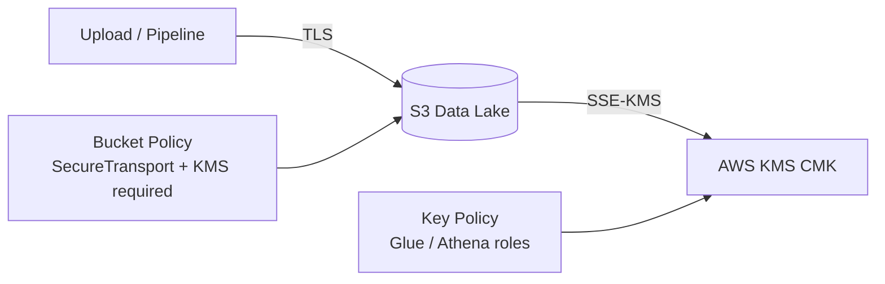

# Lab 7.1: Secure Datasets with KMS and Bucket Policies

> 📊 **Diagrams:** [Mermaid](diagram.md) · [Draw.io (lab-7.1-kms-bucket-policies.drawio)](../../../../docs/diagrams/drawio/lab-7.1-kms-bucket-policies.drawio) · [PNG](../../../../docs/diagrams/png/lab-7.1-kms-bucket-policies.png) · [SVG](../../../../docs/diagrams/svg/lab-7.1-kms-bucket-policies.svg)

**Estimated time:** 120 minutes · **Module 7**

---

## Objectives

- Create a customer-managed KMS key for the data lake bucket
- Enable SSE-KMS default encryption with S3 Bucket Key
- Apply bucket policies denying insecure transport and unencrypted uploads
- Validate encryption on upload and troubleshoot KMS access errors

---

## Prerequisites

- Module 1 Lab 1.1 complete (S3 data lake bucket)
- IAM permissions for KMS, S3 bucket policy, and encryption configuration
- Glue/Athena role ARNs from Modules 3 and 5

---


## Platform Setup

From the **repository root**, start the shared lab environment (once per session):

```bash
./scripts/lab-cycle.sh start
source ./scripts/lab-env.sh
```

Stop when finished: `./scripts/lab-cycle.sh stop --yes` (avoids ongoing AWS charges).

---


## Architecture



---

## Project Structure

```text
lab-7.1-kms-bucket-policies/
├── README.md
├── policies/
│   ├── bucket-encryption.json
│   ├── bucket-policy-secure.json
│   └── kms-key-policy.json
└── scripts/
    └── apply_encryption.sh
```

---

## Step 1: Set Environment

```bash
export BUCKET=$(cd ../../../../../infrastructure/environments/dev && terraform output -raw data_lake_bucket)
export ACCOUNT_ID=$(aws sts get-caller-identity --query Account --output text)
export AWS_REGION=us-east-1
cd modules/module-07-security-governance/labs/lab-7.1-kms-bucket-policies
chmod +x scripts/apply_encryption.sh
```

---

## Step 2: Create KMS Key and Default Encryption

```bash
./scripts/apply_encryption.sh
```

**Verification:**

```bash
aws s3api get-bucket-encryption --bucket "$BUCKET"
aws kms describe-key --key-id alias/cnde-dev-datalake-key
```

---

## Step 3: Customize and Apply Key Policy

Edit `policies/kms-key-policy.json`:

- Replace `ACCOUNT_ID`, `BUCKET_NAME`
- Add Glue role from Module 3: `terraform output glue_role_arn` (if deployed)
- Add Athena workgroup role if separate

```bash
aws kms put-key-policy \
  --key-id alias/cnde-dev-datalake-key \
  --policy-name default \
  --policy file://policies/kms-key-policy-resolved.json
```

---

## Step 4: Apply Bucket Policy

Prepare resolved policy:

```bash
export KMS_ARN=$(aws kms describe-key --key-id alias/cnde-dev-datalake-key --query KeyMetadata.Arn --output text)
export GLUE_ROLE_NAME=cnde-dev-glue-etl-role

sed -e "s/BUCKET_NAME/${BUCKET}/g" \
    -e "s/ACCOUNT_ID/${ACCOUNT_ID}/g" \
    -e "s|KMS_KEY_ARN|${KMS_ARN}|g" \
    -e "s/PIPELINE_ROLE_NAME/${GLUE_ROLE_NAME}/g" \
    policies/bucket-policy-secure.json > policies/bucket-policy-resolved.json

aws s3api put-bucket-policy --bucket "$BUCKET" --policy file://policies/bucket-policy-resolved.json
```

---

## Step 5: Test Secure Upload

```bash
echo "encryption test" > /tmp/lab71.txt

# Should succeed with KMS headers
aws s3 cp /tmp/lab71.txt "s3://${BUCKET}/metadata/security-tests/lab71-kms.txt" \
  --sse aws:kms \
  --sse-kms-key-id "$KMS_ARN"

# Verify encryption
aws s3api head-object --bucket "$BUCKET" --key metadata/security-tests/lab71-kms.txt \
  --query '{SSE:ServerSideEncryption,SSEKMSKeyId:SSEKMSKeyId}'
```

**Negative test (optional):** Attempt upload without KMS after Deny policy—expect `AccessDenied`.

---

## Step 6: Document in LAB-REPORT.md

Record:

- CMK ARN and alias
- Bucket policy Sids applied
- Head-object encryption output screenshot
- Any Glue/Athena errors after encryption and fixes

---

## Deliverables

- [ ] KMS CMK created with alias `alias/cnde-dev-datalake-key`
- [ ] Default bucket encryption = SSE-KMS
- [ ] Bucket policy with `DenyInsecureTransport` and encryption denies
- [ ] Successful KMS-encrypted test object
- [ ] `LAB-REPORT.md` complete

---

## Verification Checklist

- [ ] `get-bucket-encryption` shows `aws:kms`
- [ ] Test object `SSEKMSKeyId` matches your CMK
- [ ] Glue job (if run) completes without `KMS.AccessDeniedException`
- [ ] Public access still blocked (Module 1)

---

## Troubleshooting

| Issue | Solution |
|-------|----------|
| `KMS.AccessDeniedException` on PutObject | Update key policy with principal ARN |
| Deny unencrypted upload blocks pipeline | Pipeline must pass `--sse aws:kms` or default encryption |
| DenyWrongKMSKey on valid upload | Match `s3:x-amz-server-side-encryption-aws-kms-key-id` exactly |
| Bucket policy too large | Split PHI bucket to separate bucket (Assignment 7) |
| `MalformedPolicy` Invalid principal | Use full IAM role ARN not username |
| Glue slow after KMS | Enable `BucketKeyEnabled` in encryption config |

---

## What You Learned

- SSE-KMS is the compliance-grade default for regulated data lakes
- Bucket policies enforce transport and encryption invariants
- KMS key policies must align with S3 and service roles
- Defense in depth complements IAM identity policies

---

**Next:** [Lab 7.2 – IAM Role-Based Access Controls](../lab-7.2-iam-rbac-data-zones/README.md)
