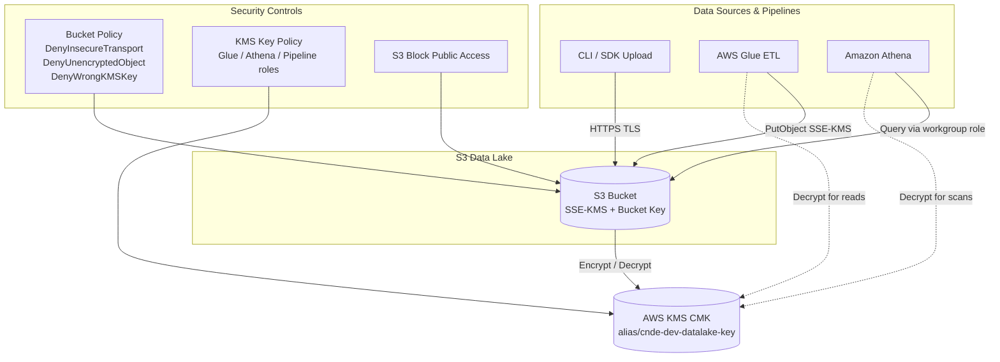
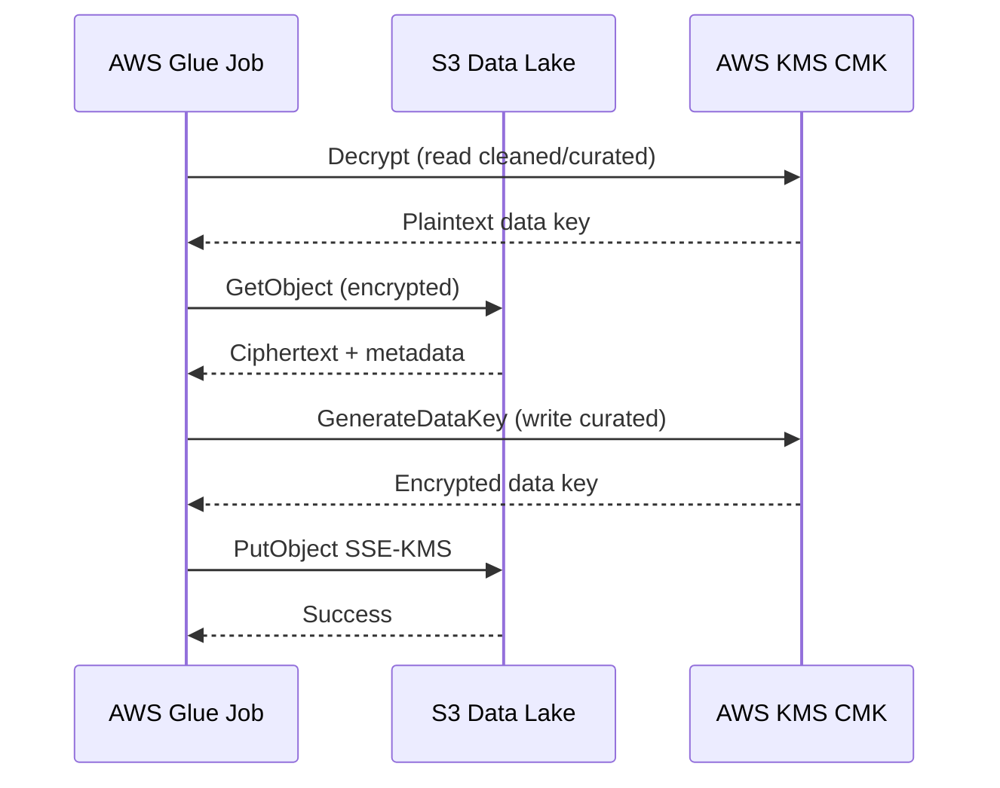

# Lab 7.1 Architecture: KMS and Bucket Policies

Secure the S3 data lake with customer-managed KMS encryption, bucket policies enforcing TLS and encryption invariants, and key policies granting least-privilege access to pipeline and analytics roles.

---

## Architecture Diagram

---

## Key Components

| Component | AWS Service / Artifact | Role in Lab |
|-----------|------------------------|-------------|
| Data Lake Bucket | Amazon S3 | Primary storage for raw, cleaned, curated, and quarantine zones |
| Customer-Managed Key | AWS KMS (`alias/cnde-dev-datalake-key`) | Encrypts all objects at rest; central key for compliance |
| Default Encryption | S3 bucket encryption config | Enforces SSE-KMS on every new object; Bucket Key reduces KMS API calls |
| Bucket Policy | `policies/bucket-policy-secure.json` | Denies HTTP, unencrypted uploads, and wrong KMS key usage |
| Key Policy | `policies/kms-key-policy.json` | Grants `kms:Decrypt`, `kms:GenerateDataKey` to Glue and Athena roles |
| Block Public Access | S3 account/bucket setting | Prevents accidental public exposure (Module 1) |
| Apply Script | `scripts/apply_encryption.sh` | Creates CMK, enables default encryption, applies baseline config |
| Pipeline Role | IAM (`cnde-dev-glue-etl-role`) | Glue ETL principal referenced in key and bucket policies |

---

## Data Flows

### Flow 1: Encrypted Upload (Success Path)

| Step | Actor | Action | Protocol / Control |
|------|-------|--------|-------------------|
| 1 | Data engineer or pipeline | Initiates `PutObject` with `--sse aws:kms` | HTTPS (TLS 1.2+) |
| 2 | S3 | Evaluates bucket policy — transport and encryption checks pass | Allow |
| 3 | S3 | Calls KMS `GenerateDataKey` using CMK | Key policy authorizes principal |
| 4 | KMS | Returns data key; S3 encrypts object | SSE-KMS header set |
| 5 | S3 | Stores ciphertext in target prefix (e.g., `metadata/security-tests/`) | Object encrypted at rest |

### Flow 2: Policy Deny (Negative Test)

| Step | Actor | Action | Result |
|------|-------|--------|--------|
| 1 | Client | Attempts upload without SSE-KMS or over HTTP | Request reaches S3 |
| 2 | Bucket Policy | `DenyUnencryptedObject` or `DenyInsecureTransport` matches | `AccessDenied` |
| 3 | S3 | Object not written | Pipeline must use default encryption or explicit KMS headers |

### Flow 3: Glue ETL Read/Write with KMS

---

## Security Invariants

| Invariant | Enforcement Mechanism |
|-----------|----------------------|
| Encryption at rest | SSE-KMS default + Deny unencrypted objects |
| Encryption in transit | `aws:SecureTransport = false` → Deny |
| Correct key only | `s3:x-amz-server-side-encryption-aws-kms-key-id` condition |
| Least privilege | Key policy lists explicit role ARNs, not `*` |
| No public access | Block Public Access (four settings = true) |
