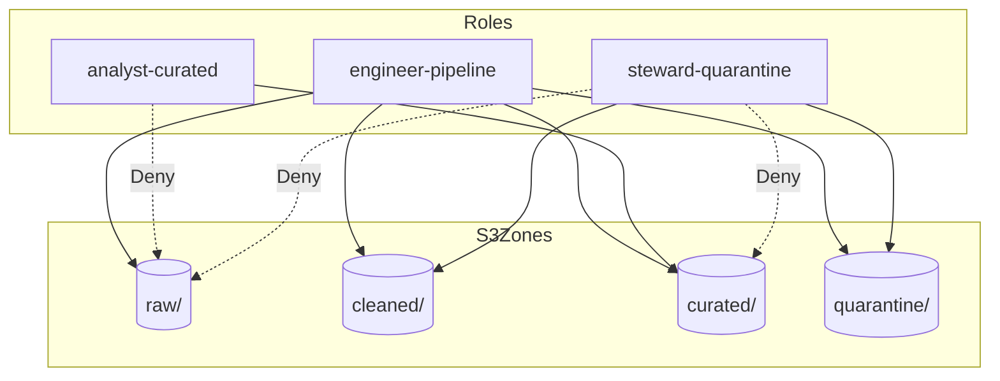

# Lab 7.2: IAM Role-Based Access Controls for Data Zones

> 📊 **Diagrams:** [Mermaid](diagram.md) · [Draw.io (lab-7.2-iam-rbac-data-zones.drawio)](../../../../docs/diagrams/drawio/lab-7.2-iam-rbac-data-zones.drawio) · [PNG](../../../../docs/diagrams/png/lab-7.2-iam-rbac-data-zones.png) · [SVG](../../../../docs/diagrams/svg/lab-7.2-iam-rbac-data-zones.svg)

**Estimated time:** 90 minutes · **Module 7**

---

## Objectives

- Create three IAM roles mapped to data lake zones (engineer, analyst, steward)
- Apply least-privilege policies with explicit Deny on sensitive prefixes
- Test access with `aws sts assume-role` and S3/Athena calls
- Document RBAC matrix for Assignment 7 healthcare scenario

---

## Prerequisites

- Lab 7.1 complete (KMS encryption configured)
- Module 1 zone structure (`raw/`, `cleaned/`, `curated/`, `quarantine/`)

---

## Architecture



---

## Project Structure

```text
lab-7.2-iam-rbac-data-zones/
├── README.md
└── policies/
    ├── analyst-curated-read.json
    ├── engineer-pipeline-write.json
    └── steward-quarantine.json
```

---

## Step 1: Create IAM Roles

```bash
export BUCKET=$(cd ../../../../../infrastructure/environments/dev && terraform output -raw data_lake_bucket)
export ACCOUNT_ID=$(aws sts get-caller-identity --query Account --output text)
cd modules/module-07-security-governance/labs/lab-7.2-iam-rbac-data-zones

for ROLE in cnde-dev-analyst-curated cnde-dev-engineer-pipeline cnde-dev-steward-quarantine; do
  aws iam create-role --role-name "$ROLE" --assume-role-policy-document '{
    "Version": "2012-10-17",
    "Statement": [{
      "Effect": "Allow",
      "Principal": {"AWS": "arn:aws:iam::'"$ACCOUNT_ID"':root"},
      "Action": "sts:AssumeRole"
    }]
  }' 2>/dev/null || echo "Role $ROLE may already exist"
done
```

---

## Step 2: Attach Zone Policies

```bash
for PAIR in "cnde-dev-analyst-curated:analyst-curated-read" \
            "cnde-dev-engineer-pipeline:engineer-pipeline-write" \
            "cnde-dev-steward-quarantine:steward-quarantine"; do
  ROLE="${PAIR%%:*}"
  POLICY="${PAIR##*:}"
  sed "s/BUCKET_NAME/${BUCKET}/g" "policies/${POLICY}.json" > "/tmp/${POLICY}-resolved.json"
  aws iam put-role-policy --role-name "$ROLE" \
    --policy-name "${POLICY}" \
    --policy-document "file:///tmp/${POLICY}-resolved.json"
done
```

---

## Step 3: Test Analyst Access

```bash
CREDS=$(aws sts assume-role \
  --role-arn "arn:aws:iam::${ACCOUNT_ID}:role/cnde-dev-analyst-curated" \
  --role-session-name lab72-analyst \
  --query 'Credentials.[AccessKeyId,SecretAccessKey,SessionToken]' --output text)

export AWS_ACCESS_KEY_ID=$(echo $CREDS | awk '{print $1}')
export AWS_SECRET_ACCESS_KEY=$(echo $CREDS | awk '{print $2}')
export AWS_SESSION_TOKEN=$(echo $CREDS | awk '{print $3}')

# Should succeed
aws s3 ls "s3://${BUCKET}/curated/" 

# Should fail (Deny)
aws s3 ls "s3://${BUCKET}/raw/" || echo "Expected Deny on raw"
```

Unset session credentials after test:

```bash
unset AWS_ACCESS_KEY_ID AWS_SECRET_ACCESS_KEY AWS_SESSION_TOKEN
```

---

## Step 4: Test Steward Quarantine Access

Assume `cnde-dev-steward-quarantine` and verify:

- [ ] Can list `quarantine/`
- [ ] Cannot `GetObject` on `raw/` sample path
- [ ] Can `PutObject` replay file to `cleaned/` (test file only)

---

## Step 5: RBAC Matrix

Complete in `LAB-REPORT.md`:

| Action | Engineer | Analyst | Steward |
|--------|----------|---------|---------|
| Read raw | | | |
| Write curated | | | |
| Read quarantine | | | |
| Start Athena on fact_orders | | | |

---

## Deliverables

- [ ] Three IAM roles with inline policies deployed
- [ ] Assume-role tests documented (pass/fail)
- [ ] RBAC matrix completed
- [ ] `LAB-REPORT.md` with security recommendations

---

## Verification Checklist

- [ ] Analyst Deny on `raw/*` enforced
- [ ] Engineer can write to `cleaned/` and `curated/`
- [ ] Steward can access `quarantine/` only (plus cleaned replay)
- [ ] No role has `s3:*` on `/*`

---

## Troubleshooting

| Issue | Solution |
|-------|----------|
| Deny not enforced | Identity policy may override; check policy evaluation order |
| Analyst can read raw | Remove conflicting Allow on `arn:aws:s3:::bucket/*` |
| AssumeRole denied | Trust policy Principal must include your user/role |
| Athena works but S3 denied | Athena uses workgroup role—not analyst role; test via Athena only |
| KMS decrypt fails after Lab 7.1 | Add analyst role to KMS key policy for curated reads |

---

## What You Learned

- Zone-based RBAC maps business roles to S3 prefixes
- Explicit Deny protects raw PHI even if Allow exists elsewhere
- Service roles (Glue) differ from human analyst roles
- Lake Formation can centralize grants in production (Week 7 lecture)

---

**Next:** [Lab 7.3 – Governance Validation & Audit Report](../lab-7.3-governance-audit/README.md)
