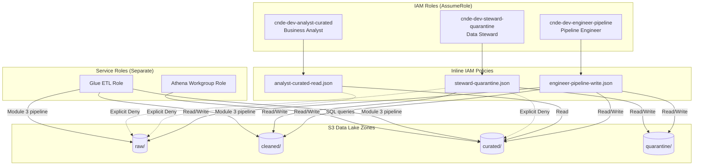
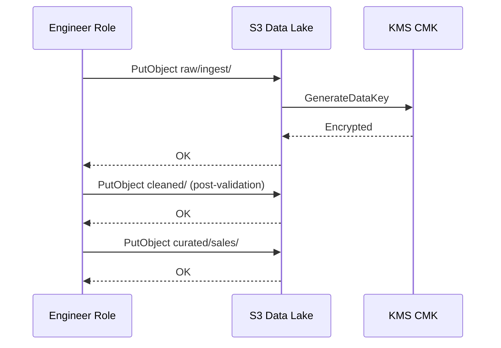

# Lab 7.2 Architecture: IAM RBAC for Data Zones

Implement zone-based role-based access control (RBAC) mapping business personas—data engineer, analyst, and data steward—to S3 prefix permissions with explicit Deny statements on sensitive zones.

---

## Architecture Diagram

---

## Key Components

| Component | AWS Service / Artifact | Role in Lab |
|-----------|------------------------|-------------|
| Engineer Role | IAM `cnde-dev-engineer-pipeline` | Full pipeline write access across all zones |
| Analyst Role | IAM `cnde-dev-analyst-curated` | Read-only on `curated/`; Deny on `raw/` |
| Steward Role | IAM `cnde-dev-steward-quarantine` | Manage quarantine; replay to `cleaned/`; Deny raw/curated |
| Engineer Policy | `policies/engineer-pipeline-write.json` | Allow list/get/put on zone prefixes |
| Analyst Policy | `policies/analyst-curated-read.json` | Allow curated reads + explicit Deny on raw |
| Steward Policy | `policies/steward-quarantine.json` | Quarantine access + cleaned replay writes |
| Trust Policy | IAM assume-role document | Permits account principals to assume test roles |
| KMS CMK | AWS KMS (Lab 7.1) | Analyst/steward need decrypt for allowed prefixes |
| Glue Service Role | IAM (Module 3) | Separate from human roles; runs ETL jobs |

---

## Data Flows

### Flow 1: Analyst Curated Read (Allowed)

| Step | Actor | Action | Result |
|------|-------|--------|--------|
| 1 | User | `sts:AssumeRole` → analyst role | Temporary credentials issued |
| 2 | Analyst | `s3:ListBucket` on `curated/` prefix | Success |
| 3 | Analyst | `s3:GetObject` on `curated/sales/fact_orders/` | Success (KMS decrypt if encrypted) |
| 4 | Analyst | `s3:ListBucket` on `raw/` | **AccessDenied** (explicit Deny) |

### Flow 2: Steward Quarantine Remediation

| Step | Actor | Action | Result |
|------|-------|--------|--------|
| 1 | Steward | Lists `quarantine/` for failed records | Success |
| 2 | Steward | Downloads quarantined JSON for review | Success |
| 3 | Steward | `PutObject` corrected file to `cleaned/` | Success (replay path) |
| 4 | Steward | `GetObject` from `raw/clinical/` | **AccessDenied** |

### Flow 3: Engineer Pipeline Write

---

## RBAC Matrix (Lab Reference)

| Action | Engineer | Analyst | Steward |
|--------|----------|---------|---------|
| Read `raw/` | Allow | **Deny** | **Deny** |
| Write `cleaned/` | Allow | Deny | Allow (replay) |
| Read `curated/` | Allow | Allow | **Deny** |
| Read `quarantine/` | Allow | Deny | Allow |
| Start Athena on fact tables | Via workgroup role | Via workgroup role | Deny (human role) |

---

## Design Notes

- **Explicit Deny wins** over Allow in IAM policy evaluation—protects PHI in `raw/` even if a broad Allow exists elsewhere.
- **Human roles ≠ service roles** — Glue and Athena use their own IAM roles configured in Modules 3 and 5.
- **Production upgrade:** AWS Lake Formation can centralize fine-grained grants; this lab teaches prefix-based RBAC fundamentals.
