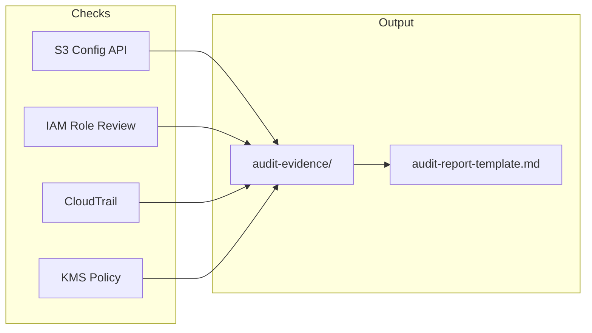

# Lab 7.3: Governance Validation and Audit Report

> 📊 **Diagrams:** [Mermaid](diagram.md) · [Draw.io (lab-7.3-governance-audit.drawio)](../../../../docs/diagrams/drawio/lab-7.3-governance-audit.drawio) · [PNG](../../../../docs/diagrams/png/lab-7.3-governance-audit.png) · [SVG](../../../../docs/diagrams/svg/lab-7.3-governance-audit.svg)

**Estimated time:** 90 minutes · **Module 7**

---

## Objectives

- Execute automated governance pre-checks against the data lake
- Complete a professional security audit report from the course template
- Validate Lab 7.1 and 7.2 controls with evidence
- Identify findings with severity and remediation owners
- Prepare appendix material for Assignment 7 (HIPAA framework)

---

## Prerequisites

- Labs 7.1 and 7.2 complete
- Read access to IAM, S3, CloudTrail, KMS
- Optional: CloudTrail trail enabled in dev account

---

## Architecture



---

## Project Structure

```text
lab-7.3-governance-audit/
├── README.md
├── scripts/
│   └── run_audit_checks.sh
└── templates/
    └── audit-report-template.md
```

---

## Step 1: Collect Evidence

```bash
export BUCKET=$(cd ../../../../../infrastructure/environments/dev && terraform output -raw data_lake_bucket)
cd modules/module-07-security-governance/labs/lab-7.3-governance-audit
chmod +x scripts/run_audit_checks.sh
./scripts/run_audit_checks.sh
```

Review files in `audit-evidence/`.

---

## Step 2: Manual Control Tests

Perform Lab 7.2 assume-role tests again. Record Pass/Fail in Section 7 of the template.

**KMS check:**

```bash
aws kms describe-key --key-id alias/cnde-dev-datalake-key \
  --query 'KeyMetadata.{Enabled:Enabled,KeyRotation:KeyRotationEnabled}'
```

**Athena workgroup logging:**

```bash
aws athena get-work-group --work-group primary \
  --query 'WorkGroup.Configuration' 2>/dev/null || echo "Use your analytics workgroup name"
```

---

## Step 3: Complete Audit Report

Copy template:

```bash
cp templates/audit-report-template.md "audit-report-$(date +%Y%m%d).md"
```

Fill all sections using evidence. Include at least:

- 1 **Critical** or **High** finding (real or simulated for learning—e.g., "CloudTrail data events not enabled on raw/clinical")
- 3 remediation items with owners and due dates

---

## Step 4: Governance Validation Checklist

Mark each item in your report:

| # | Validation Item | Pass |
|---|-----------------|------|
| 1 | Block Public Access = true (all four settings) | ☐ |
| 2 | SSE-KMS default encryption | ☐ |
| 3 | SecureTransport Deny in bucket policy | ☐ |
| 4 | Analyst Deny on raw prefix | ☐ |
| 5 | No wildcard admin attached to pipeline roles | ☐ |
| 6 | SNS/Step Functions messages contain no record payloads | ☐ |
| 7 | Quarantine lifecycle ≤ 90 days documented | ☐ |
| 8 | CloudTrail management events enabled | ☐ |
| 9 | Classification tags documented in metadata/ | ☐ |
| 10 | Break-glass procedure documented | ☐ |

---

## Step 5: Present Findings (Optional)

Prepare 3-slide summary:

1. Posture dashboard (pass/fail counts)
2. Top findings and risk
3. 30/60/90 day remediation roadmap

---

## Deliverables

- [ ] `audit-evidence/` folder with command output
- [ ] Completed `audit-report-YYYYMMDD.md`
- [ ] Validation checklist ≥ 8/10 passed (or failures documented)
- [ ] `LAB-REPORT.md` with remediation roadmap

---

## Verification Checklist

- [ ] Every Fail in control table has matching finding ID
- [ ] Evidence snippets redact account-specific secrets
- [ ] Sign-off section completed (names optional for lab)
- [ ] Report references Lab 7.1 and 7.2 test results

---

## Troubleshooting

| Issue | Solution |
|-------|----------|
| get-public-access-block error | Block Public Access may not be configured—record as finding F-001 |
| No CloudTrail trails | Document as AUD-01 Fail; recommend trail creation |
| Cannot assume test roles | Fix trust policy Principal |
| Too many false failures in dev | Mark "accepted risk for dev" with prod remediation plan |
| Template too long | Complete required tables; narrative optional for lab |

---

## What You Learned

- Governance requires **evidence**, not checkbox claims
- Audit reports drive prioritized remediation
- Automated scripts plus manual role tests cover technical controls
- HIPAA and enterprise compliance consume these reports quarterly

---

**Next:** [Assignment 7](../../assignments/assignment-07.md)
