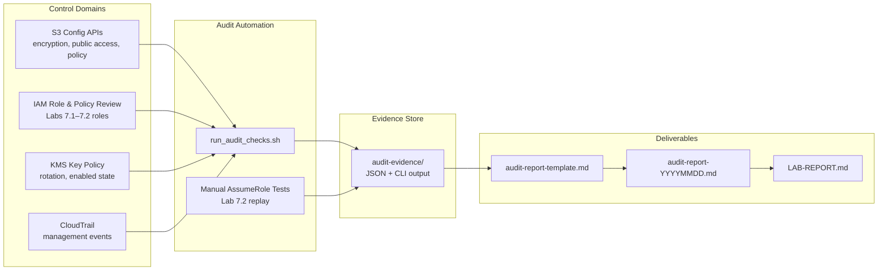
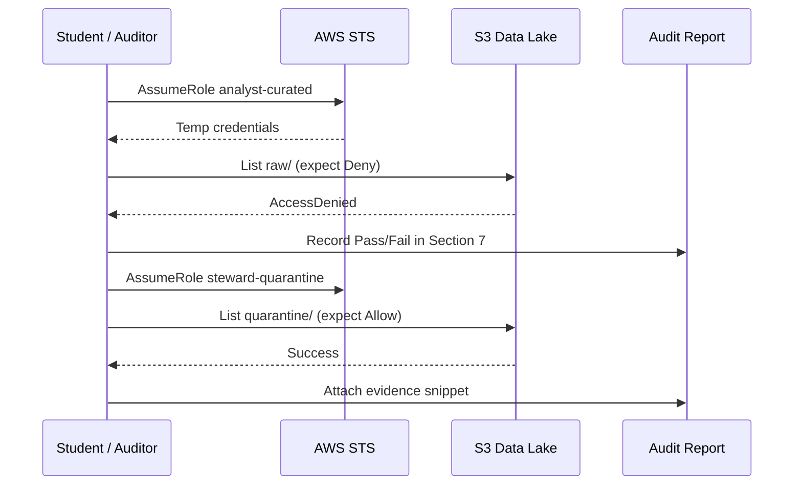
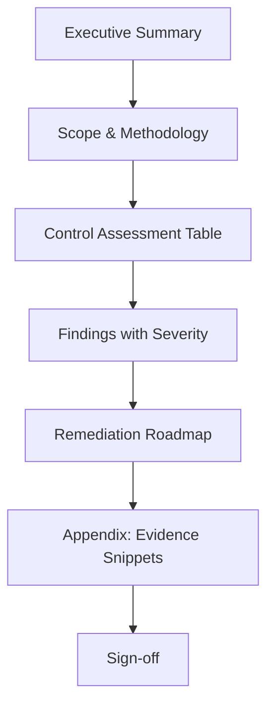

# Lab 7.3 Architecture: Governance Validation and Audit Report

Automated governance pre-checks collect evidence from S3, IAM, KMS, and CloudTrail; findings feed a professional audit report template aligned with HIPAA and enterprise compliance workflows.

---

## Architecture Diagram

---

## Key Components

| Component | AWS Service / Artifact | Role in Lab |
|-----------|------------------------|-------------|
| Audit Script | `scripts/run_audit_checks.sh` | Collects S3, IAM, KMS, CloudTrail evidence via CLI |
| Evidence Folder | `audit-evidence/` | Timestamped command outputs for report citations |
| Report Template | `templates/audit-report-template.md` | Structured audit document with findings table |
| S3 Public Access Block | Amazon S3 | Validates all four block settings = true |
| Bucket Encryption | S3 `get-bucket-encryption` | Confirms SSE-KMS from Lab 7.1 |
| IAM RBAC Roles | IAM (Lab 7.2) | Re-tested with assume-role for pass/fail evidence |
| KMS CMK | AWS KMS | Key rotation and policy review |
| CloudTrail | AWS CloudTrail | Management event logging; data events gap = finding |
| Validation Checklist | Lab README Section 4 | 10-item governance scorecard |

---

## Data Flows

### Flow 1: Automated Evidence Collection

| Step | Source | Check | Evidence File |
|------|--------|-------|---------------|
| 1 | S3 API | Block Public Access configuration | `audit-evidence/s3-public-access.json` |
| 2 | S3 API | Default encryption (SSE-KMS) | `audit-evidence/s3-encryption.json` |
| 3 | S3 API | Bucket policy document | `audit-evidence/s3-bucket-policy.json` |
| 4 | IAM API | Role policies for 7.2 roles | `audit-evidence/iam-roles.json` |
| 5 | KMS API | Key metadata and rotation | `audit-evidence/kms-key.json` |
| 6 | CloudTrail | Trail status and event selectors | `audit-evidence/cloudtrail.json` |

### Flow 2: Manual Control Validation

### Flow 3: Finding → Remediation Loop

| Step | Actor | Action | Output |
|------|-------|--------|--------|
| 1 | Auditor | Maps failed checklist item to finding ID (e.g., F-001) | Finding table row |
| 2 | Auditor | Assigns severity (Critical / High / Medium / Low) | Risk rating |
| 3 | Auditor | Defines remediation owner and due date | 30/60/90-day roadmap |
| 4 | Stakeholder | Reviews sign-off section | Audit report complete |

---

## Governance Validation Checklist (Architecture Mapping)

| # | Control | Primary Evidence Source |
|---|---------|------------------------|
| 1 | Block Public Access | S3 `get-public-access-block` |
| 2 | SSE-KMS default | S3 `get-bucket-encryption` |
| 3 | SecureTransport Deny | Bucket policy Sid review |
| 4 | Analyst Deny on raw | AssumeRole test output |
| 5 | No wildcard admin on pipeline roles | IAM policy scan |
| 6 | No PII in SNS/Step Functions payloads | Orchestration config review (Module 6) |
| 7 | Quarantine lifecycle ≤ 90 days | S3 lifecycle rule documentation |
| 8 | CloudTrail management events | CloudTrail describe-trails |
| 9 | Classification tags in metadata/ | S3 object tags / metadata prefix |
| 10 | Break-glass procedure | Governance doc (Assignment 7) |

---

## Audit Report Structure

