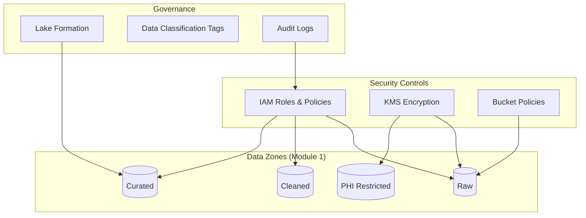
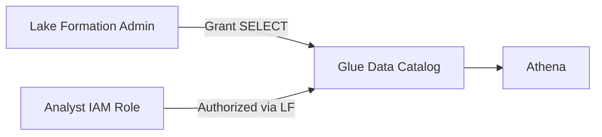

# Week 7 Lecture: Security, Governance & Compliance

**Duration:** 2 hours · **Module 7**

---

## Learning Objectives

By the end of this lecture you will:

1. Design IAM policies and roles for least-privilege data platform access
2. Implement encryption at rest (KMS) and in transit for S3 data lakes
3. Apply PII identification, masking, and zone isolation patterns
4. Configure audit logging with CloudTrail and S3 access logs
5. Establish governance models with Lake Formation and data zone RBAC

---

## 1. Security in the Data Platform Lifecycle

Modules 1–6 built pipelines and analytics. **Module 7** ensures only authorized principals access the right data, encryption protects data at rest, and **audit trails** prove who did what for compliance.



**Defense in depth:** No single control is sufficient. Combine IAM, bucket policies, encryption, network boundaries (where applicable), and governance catalogs.

---

## 2. IAM for Data Platforms

### Principals

| Principal | Typical Access |
|-----------|----------------|
| **Data engineer role** | Glue, Lambda deploy, broad S3 on dev only |
| **Pipeline service roles** | Scoped S3 prefixes; no console login |
| **Analyst role** | Athena read on curated; no raw PHI |
| **Audit role** | Read CloudTrail, S3 access logs; no data modify |
| **Break-glass admin** | Emergency; MFA; time-limited |

### Policy Structure

```json
{
  "Version": "2012-10-17",
  "Statement": [
    {
      "Sid": "ListBucketScoped",
      "Effect": "Allow",
      "Action": ["s3:ListBucket"],
      "Resource": "arn:aws:s3:::datalake-prod",
      "Condition": {
        "StringLike": {
          "s3:prefix": ["curated/retail/*", "athena-results/*"]
        }
      }
    },
    {
      "Sid": "ReadCuratedObjects",
      "Effect": "Allow",
      "Action": ["s3:GetObject"],
      "Resource": "arn:aws:s3:::datalake-prod/curated/retail/*"
    }
  ]
}
```

### Role Assumption Chain

```text
Analyst User → IAM Role (analyst-data-zone)
                    → Athena Workgroup (enforced)
                    → Glue Catalog (Lake Formation authorized)
                    → S3 curated prefix only
```

**Anti-pattern:** Attach `AmazonS3FullAccess` to analyst users.

---

## 3. Encryption

### At Rest — AWS KMS

| Approach | Description |
|----------|-------------|
| **SSE-S3** | S3-managed keys; simple, no key policy control |
| **SSE-KMS** | Customer-managed CMK; audit via CloudTrail; required for many compliance frameworks |
| **DSSE-KMS** | Dual-layer encryption (newer S3 feature) |

Default bucket encryption (Module 1 extension):

```json
{
  "Rules": [{
    "ApplyServerSideEncryptionByDefault": {
      "SSEAlgorithm": "aws:kms",
      "KMSMasterKeyID": "arn:aws:kms:us-east-1:ACCOUNT:key/KEY_ID"
    },
    "BucketKeyEnabled": true
  }]
}
```

**Bucket Key** reduces KMS API costs for high-volume S3.

### In Transit

- TLS 1.2+ for all AWS API calls (default)
- Deny insecure transport in bucket policy (`aws:SecureTransport`)
- VPC endpoints for private subnet workloads (optional enterprise)

### Key Policies

CMK must allow:

- S3 service usage via bucket policy reference
- Glue / Athena service roles for decrypt
- Security account audit role for `kms:Decrypt` (read-only audits)

---

## 4. PII and Sensitive Data

### Classification Levels

| Tag | Examples | Zone |
|-----|----------|------|
| **Public** | Aggregated category revenue | Curated |
| **Internal** | Customer segment counts | Curated |
| **Confidential** | Email, address | Cleaned (masked in curated) |
| **PHI/PCI** | MRN, diagnosis, card numbers | Restricted prefix; no Athena for general analysts |

### Protection Techniques

| Technique | When |
|-----------|------|
| **Tokenization** | Replace identifier with reversible token (restricted store) |
| **Hashing (salted)** | Irreversible linkage for analytics |
| **Masking** | `email → j***@example.com` in curated |
| **Redaction** | Remove field from downstream entirely |
| **Synthetic data** | Dev/test environments |

### Pipeline Rules (Module 4 + 7)

- Validation error messages **must not** echo raw PHI
- SNS alerts (Module 6) include execution metadata only—not record payloads
- Quarantine paths for PHI segregated with stricter IAM

---

## 5. Audit Logging

### AWS CloudTrail

- Management events: IAM changes, bucket policy updates
- Data events (optional, cost): S3 object-level API activity
- Store logs in dedicated audit bucket with Object Lock (immutable)

### S3 Server Access Logging

- Target bucket with restricted access
- Correlates `GetObject` / `PutObject` with requester

### Glue and Athena

- CloudWatch Logs for job runs
- Athena query history in workgroup (who ran what query)

### Audit Questions Answered

| Question | Source |
|----------|--------|
| Who deleted raw files? | CloudTrail data events |
| Who queried PHI table? | Athena workgroup logs + LF audit |
| Was encryption enforced? | S3 bucket policy + default encryption config |

---

## 6. AWS Lake Formation

Lake Formation adds **centralized permissions** on Glue Data Catalog resources:

- Databases, tables, columns
- Tag-based access control (LF-TBAC)
- Integration with Athena and Redshift Spectrum



**Course labs:** Lab 7.2 simulates zone RBAC with IAM; production often adds Lake Formation on curated databases.

---

## 7. Governance Models

### Centralized vs Federated

| Model | Description | Best For |
|-------|-------------|----------|
| **Centralized** | Single data platform team owns all zones | Regulated industries, smaller orgs |
| **Federated** | Domain teams own curated datasets; platform sets standards | Large enterprises |
| **Data mesh** | Domain products with inter-domain contracts | Mature engineering orgs |

### RACI (Healthcare Example)

| Activity | Data Platform | Security | Clinical Domain | Compliance |
|----------|---------------|----------|-----------------|------------|
| Zone IAM policies | R/A | C | I | I |
| PII classification | C | C | R/A | I |
| Audit report | R | A | I | C |
| Break-glass access | I | R/A | I | C |

*R=Responsible, A=Accountable, C=Consulted, I=Informed*

### Policies and Standards

Document in `metadata/governance/`:

- Data classification standard
- Retention and deletion schedules
- Access review cadence (quarterly)
- Incident response for data breaches

---

## 8. HIPAA Alignment (Healthcare Context)

HIPAA Security Rule technical safeguards map to AWS controls:

| Safeguard | AWS Implementation |
|-----------|-------------------|
| Access control | IAM, LF, MFA |
| Audit controls | CloudTrail, S3 logs, Athena history |
| Integrity | Versioning, checksums, quality framework |
| Transmission security | TLS, `aws:SecureTransport` |
| Encryption | KMS SSE-KMS on PHI buckets |

**BAA:** AWS services under Business Associate Agreement—verify service is HIPAA-eligible before storing PHI.

**Minimum necessary:** Analysts receive only columns required for their role (column-level LF grants).

---

## 9. Building on Prior Modules

| Module | Security Enhancement |
|--------|---------------------|
| **1** | Bucket encryption, public access block, zone prefixes |
| **2** | Lambda execution role scoped to `raw/` |
| **3** | Glue role read/write separation |
| **4** | Quarantine access restricted to stewards |
| **5** | Curated views exclude direct identifiers |
| **6** | SNS messages sanitized; pipeline audit in `metadata/pipeline-runs/` |

---

## 10. Troubleshooting Reference

| Symptom | Likely Cause | Fix |
|---------|--------------|-----|
| `Access Denied` on S3 despite IAM allow | Deny in bucket or KMS key policy | Check explicit Deny and CMK policy |
| Athena cannot read encrypted data | Role missing `kms:Decrypt` | Add CMK grant to Athena workgroup role |
| Analyst sees raw PHI | LF grant too broad | Column-level revoke; use masked view |
| CloudTrail gap | Data events not enabled | Enable trail with S3 data event selector |
| Cross-account access fails | Bucket policy missing principal | Add trusted account with ExternalId |
| Glue job KMS error | Job role not in key policy | Update CMK policy for glue role ARN |

---

## 11. Key Terminology

| Term | Definition |
|------|------------|
| **CMK** | Customer Master Key in KMS |
| **Least privilege** | Minimum permissions required for a task |
| **PHI** | Protected Health Information (HIPAA) |
| **LF-TBAC** | Lake Formation tag-based access control |
| **Break-glass** | Emergency elevated access with audit trail |
| **Data steward** | Business owner accountable for dataset quality and access |
| **Immutable audit** | Logs that cannot be altered (S3 Object Lock) |

---

## 12. Discussion Questions

1. Should raw PHI ever be readable by data engineers in production?
2. When is SSE-S3 acceptable vs SSE-KMS required?
3. How often should IAM access reviews occur for analyst roles?
4. Can Step Functions execution history contain PII—how do you prevent it?
5. What is the difference between masking in Glue vs restricting columns in Lake Formation?

---

## 13. This Week's Labs

| Lab | Goal |
|-----|------|
| **Lab 7.1** | KMS default encryption and bucket policies with `aws:SecureTransport` |
| **Lab 7.2** | IAM role-based access for raw / cleaned / curated zones |
| **Lab 7.3** | Governance validation checklist and audit report template |

**Assignment 7:** HIPAA governance framework for healthcare data.

---

## Further Reading

- [AWS Security Best Practices for S3](https://docs.aws.amazon.com/AmazonS3/latest/userguide/security-best-practices.html)
- [AWS Lake Formation Permissions](https://docs.aws.amazon.com/lake-formation/latest/dg/lake-formation-permissions.html)
- [HIPAA on AWS Whitepaper](https://docs.aws.amazon.com/whitepapers/latest/architecting-hipaa-security-and-compliance-on-aws/welcome.html)
- [AWS KMS Best Practices](https://docs.aws.amazon.com/kms/latest/developerguide/best-practices.html)

---

**Next:** [Lab 7.1 – Secure Datasets with KMS](../labs/lab-7.1-kms-bucket-policies/README.md)
