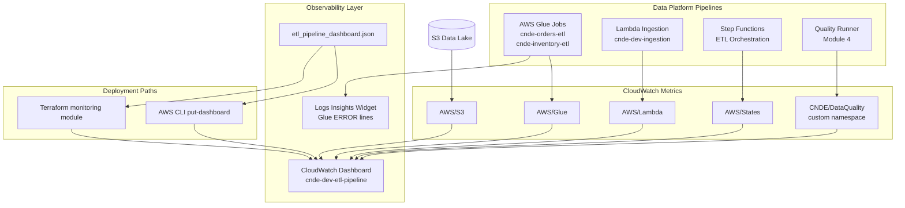
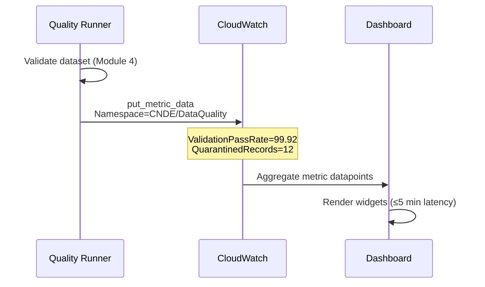

# Lab 8.1 Architecture: CloudWatch Dashboards for ETL Pipelines

Operations dashboard aggregating native AWS metrics (Glue, Lambda, Step Functions, S3) and custom application metrics (`CNDE/DataQuality`) into a single CloudWatch view for pipeline health and SLO tracking.

---

## Architecture Diagram

---

## Key Components

| Component | AWS Service / Artifact | Role in Lab |
|-----------|------------------------|-------------|
| CloudWatch Dashboard | Amazon CloudWatch | Single-pane view of pipeline SLIs and SLOs |
| Dashboard JSON | `src/etl_pipeline_dashboard.json` | Dashboard-as-code widget definitions |
| Glue Metrics | `AWS/Glue` namespace | Job failures, duration, DPU utilization |
| Lambda Metrics | `AWS/Lambda` namespace | Errors, duration, throttles for ingestion |
| Step Functions Metrics | `AWS/States` namespace | Execution success/failure counts |
| S3 Metrics | `AWS/S3` namespace | `BucketSizeBytes` for capacity trends |
| Custom Metrics | `CNDE/DataQuality` | `ValidationPassRate`, `QuarantinedRecords` |
| Logs Insights | CloudWatch Logs | Recent ERROR lines from Glue log groups |
| Terraform Module | `infrastructure/modules/monitoring/` | IaC deployment path for dashboard + alarms |
| SLO Annotation | Dashboard widget config | 99% pass-rate horizontal threshold |

---

## Data Flows

### Flow 1: Metric Emission → Dashboard Widget

| Step | Source | Metric | Dashboard Widget |
|------|--------|--------|------------------|
| 1 | Glue job run | `glue.driver.aggregate.numFailedTasks` | Glue Job Failures |
| 2 | Glue job run | `glue.driver.aggregate.elapsedTime` | Glue Job Duration |
| 3 | Lambda invocation | `Errors`, `Duration` | Lambda Health |
| 4 | Quality runner | `ValidationPassRate` (custom) | Data Quality Pass Rate |
| 5 | Quality runner | `QuarantinedRecords` (custom) | Quarantine Count |
| 6 | Step Functions | `ExecutionsFailed` | Orchestration Status |
| 7 | S3 bucket | `BucketSizeBytes` | Storage Trend |

### Flow 2: Custom Metric Publishing

### Flow 3: Dashboard Deployment

| Step | Method | Action |
|------|--------|--------|
| 1 | Developer | Resolves `ACCOUNT_ID` and job names in JSON |
| 2a | CLI path | `aws cloudwatch put-dashboard` |
| 2b | Terraform path | `terraform apply -target=module.monitoring` |
| 3 | Console | Verify widgets in CloudWatch → Dashboards |
| 4 | Operator | Add SLO annotation at 99% on pass-rate widget |

---

## Widget Categories

| Category | Purpose | Alert Integration |
|----------|---------|-------------------|
| Pipeline health | Glue failures, Lambda errors | Lab 8.2 alarms |
| Performance | Job duration, Lambda latency | Capacity planning |
| Data quality | Pass rate, quarantine volume | SLO breach → SNS warning |
| Orchestration | Step Functions success rate | Critical path monitoring |
| Capacity | S3 storage growth | Cost correlation (Lab 8.3) |
| Diagnostics | Logs Insights ERROR filter | Incident triage |

---

## SLI → SLO Mapping

| SLI (Indicator) | SLO (Objective) | Widget |
|-----------------|-----------------|--------|
| ETL success rate | Zero failed Glue tasks per run | Glue Job Failures |
| Ingestion reliability | Lambda error count = 0 | Lambda Health |
| Data quality pass rate | ≥ 99% validation pass | Pass Rate + annotation |
| Quarantine volume | Trend visibility (no hard SLO) | Quarantine Count |
