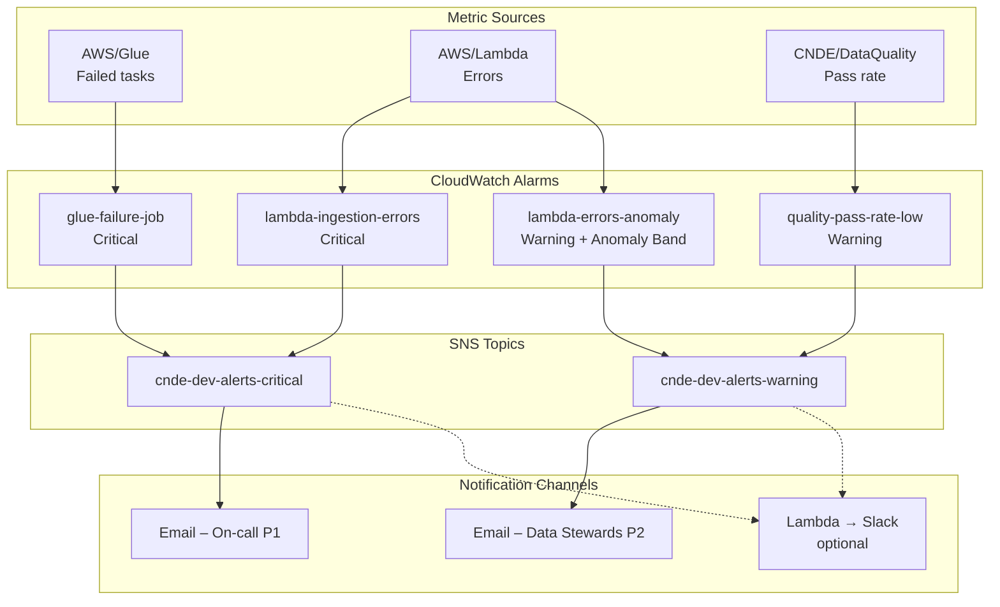
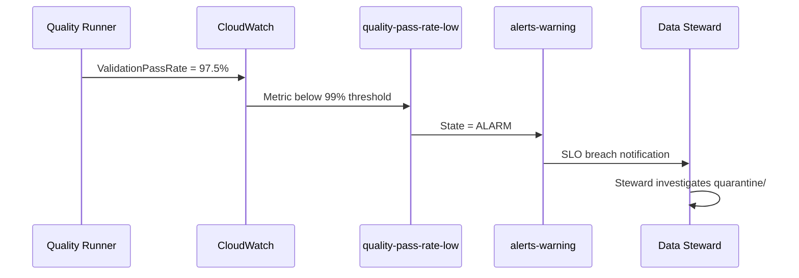
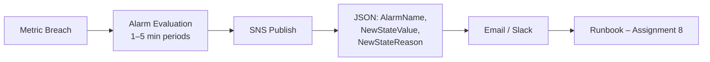

# Lab 8.2 Architecture: SNS Alerts and Anomaly Detection

Severity-based alert routing from CloudWatch alarms to SNS topics, with critical and warning channels, optional Slack integration, and anomaly detection for ingestion error baselines.

---

## Architecture Diagram

---

## Key Components

| Component | AWS Service / Artifact | Role in Lab |
|-----------|------------------------|-------------|
| Critical SNS Topic | `cnde-dev-alerts-critical` | Routes P1 alarms (Glue failure, Lambda errors) |
| Warning SNS Topic | `cnde-dev-alerts-warning` | Routes P2/P3 alarms (quality SLO, anomaly) |
| Glue Failure Alarm | CloudWatch Alarm | Triggers when failed tasks > 0 |
| Lambda Error Alarm | CloudWatch Alarm | Static threshold: errors > 0 |
| Quality Pass Rate Alarm | CloudWatch Alarm | Warning when pass rate < 99% |
| Anomaly Detection Alarm | CloudWatch Alarm | `ANOMALY_DETECTION_BAND(m1, 2)` on Lambda errors |
| Email Subscriptions | SNS → Email | Requires confirmation click in inbox |
| Terraform Module | `infrastructure/modules/monitoring/main.tf` | Provisions topics, alarms, subscriptions |
| Escalation Matrix | `escalation-matrix.md` | Documents responders and SLAs |
| Test Alarm | `cnde-dev-test-lambda-error` | Dev-only alarm for end-to-end test |

---

## Data Flows

### Flow 1: Critical Alert (Glue Job Failure)

| Step | Component | Event |
|------|-----------|-------|
| 1 | Glue ETL | Job completes with `numFailedTasks > 0` |
| 2 | CloudWatch | `glue-failure-{job}` alarm → `ALARM` state |
| 3 | SNS Critical | Publishes JSON alarm message |
| 4 | Email | On-call receives notification within 2–5 minutes |
| 5 | Operator | Acknowledges per escalation matrix (15 min SLA) |

### Flow 2: Warning Alert (Quality SLO Breach)

### Flow 3: Anomaly Detection vs Static Threshold

| Aspect | Static Alarm (`lambda-ingestion-errors`) | Anomaly Alarm (`lambda-errors-anomaly`) |
|--------|-------------------------------------------|----------------------------------------|
| Threshold | Fixed: errors > 0 | Dynamic band ±2σ from baseline |
| Baseline | N/A | Requires ~2 weeks production data |
| Use case | Hard zero-error SLO | Detect unusual spikes on noisy metrics |
| Lab behavior | Immediate trigger on test metric | Band visible; may need historical data |

### Flow 4: End-to-End Test (Lab Exercise)

| Step | Command / Action | Expected Result |
|------|------------------|-----------------|
| 1 | Create test alarm with threshold = 0 | Alarm in `OK` state |
| 2 | `put-metric-data` Errors = 1 | Metric published |
| 3 | Wait 2–5 minutes | Alarm → `ALARM` |
| 4 | SNS delivers email | Document subject + timestamp |
| 5 | Delete test alarm | Cleanup dev resources |

---

## Escalation Matrix (Reference)

| Alarm | Severity | Primary Responder | Escalation (30 min) |
|-------|----------|-------------------|---------------------|
| Glue job failure | P1 | Data engineer on-call | Platform lead |
| Lambda errors | P1 | Ingestion owner | Data engineer on-call |
| Pass rate low | P2 | Data steward | Data engineer |
| Anomaly detected | P3 | Data engineer | — |

---

## Alert Message Flow

