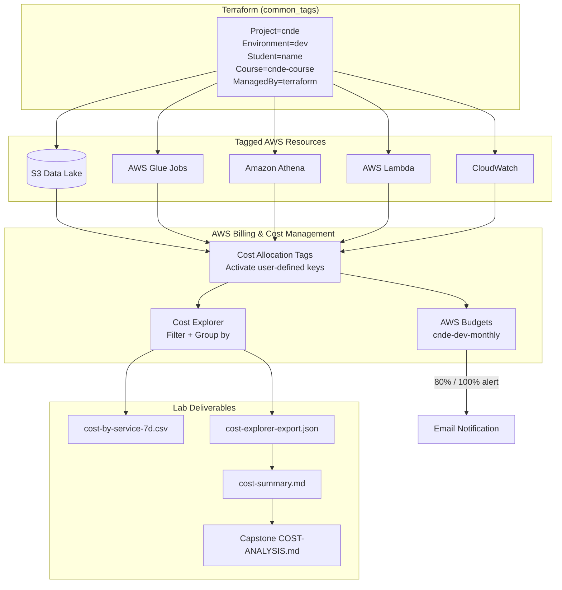
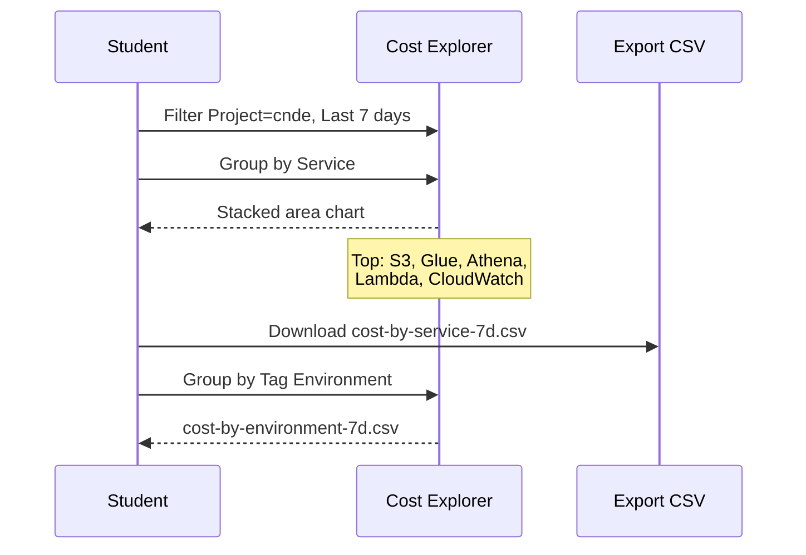
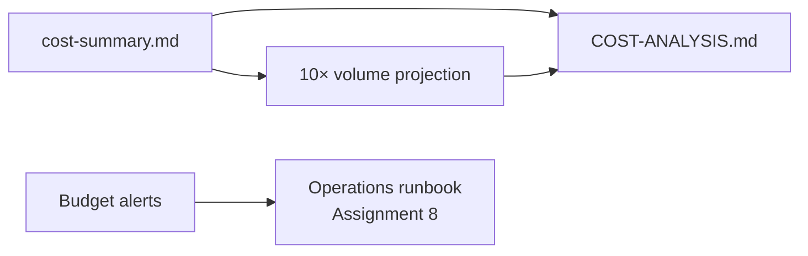

# Lab 8.3 Architecture: Cost Reporting with Tags and Cost Explorer

Cost allocation tags on Terraform-managed resources flow into AWS Billing, enabling Cost Explorer reports, AWS Budgets alerts, and capstone-ready cost summaries.

---

## Architecture Diagram

---

## Key Components

| Component | AWS Service / Artifact | Role in Lab |
|-----------|------------------------|-------------|
| Common Tags | Terraform `local.common_tags` | Consistent labels on all IaC resources |
| `Project` tag | User-defined cost allocation tag | Primary filter: `Project = cnde` |
| `Environment` tag | User-defined cost allocation tag | Separates dev / staging / prod spend |
| `Student` tag | User-defined cost allocation tag | Lab attribution and showback |
| Cost Allocation Tags | AWS Billing console | Must activate tags before Cost Explorer visibility |
| Cost Explorer | AWS Cost Explorer | Service breakdown, daily trends, CSV export |
| AWS Budgets | `cnde-dev-monthly` | $50/month limit with 80% threshold alert |
| CE CLI | `aws ce get-cost-and-usage` | Programmatic cost export |
| S3 Storage Metric | CloudWatch `BucketSizeBytes` | Correlates storage growth with S3 line item |
| Cost Summary | `cost-summary.md` | Structured report for capstone handoff |

---

## Data Flows

### Flow 1: Tag Propagation → Cost Visibility

| Step | Actor | Action | Timeline |
|------|-------|--------|----------|
| 1 | Terraform | Applies tags on `apply` | Immediate on resource |
| 2 | Admin | Activates tags in Billing → Cost Allocation Tags | One-time setup |
| 3 | AWS Billing | Propagates tags to cost data | Up to 24 hours |
| 4 | Student | Filters Cost Explorer by `Project = cnde` | Tags visible after propagation |

### Flow 2: Cost Explorer Report Generation

### Flow 3: Budget Alert

| Step | Trigger | Action |
|------|---------|--------|
| 1 | Monthly spend reaches 80% of $50 | Budget notification fires |
| 2 | SNS/Email | Subscriber receives ACTUAL > 80% alert |
| 3 | Student | Documents in `cost-summary.md` Budget Status section |
| 4 | Optimization | Applies lifecycle, bookmarks, retention changes |

---

## Typical Cost Breakdown (Dev Lab Environment)

| Service | Typical Driver | Optimization (Lab) |
|---------|----------------|-------------------|
| Amazon S3 | Storage + requests | Lifecycle: raw/ → IA @ 90d |
| AWS Glue | DPU-hours per ETL run | Job bookmarks, right-size DPU |
| Amazon Athena | Data scanned per query | Partition projection, column pruning |
| AWS Lambda | Ingestion invocations | Right-size memory, batch where possible |
| Amazon CloudWatch | Log retention + custom metrics | Reduce retention, aggregate metrics |

---

## Report Types

| Report | Group By | Filter | Output File |
|--------|----------|--------|-------------|
| Service breakdown | Service | `Project = cnde` | `cost-by-service-7d.csv` |
| Environment split | Tag `Environment` | `Project = cnde` | `cost-by-environment-7d.csv` |
| Glue daily trend | None | Service = Glue + Project | Notes in lab report |
| CLI export | Service (daily) | Tag filter JSON | `cost-explorer-export.json` |

---

## Capstone Connection

