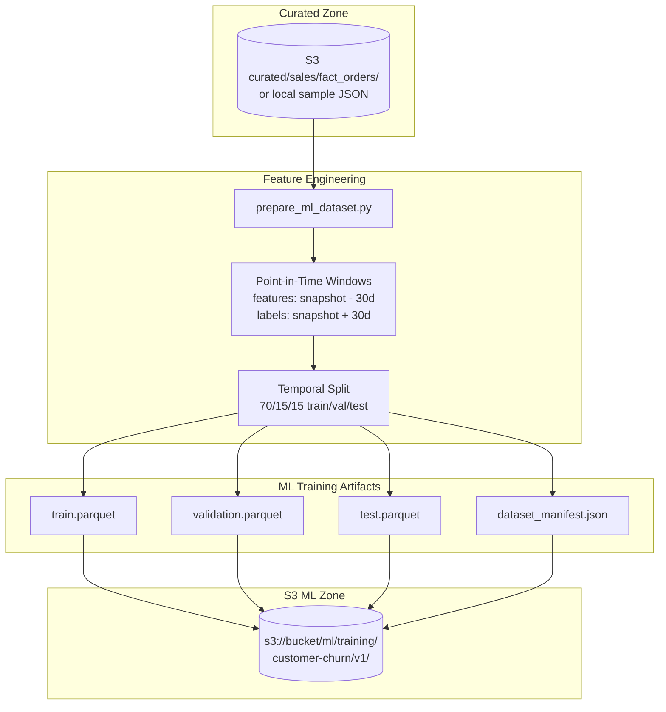
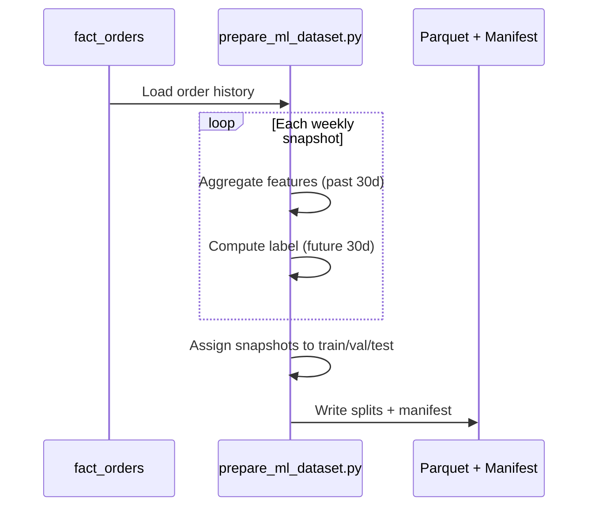
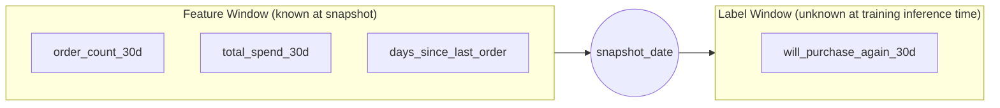

# Lab 9.1 Architecture: ML Training Dataset Preparation

Transform curated business data into point-in-time ML features with temporal train/validation/test splits, producing Parquet datasets and a manifest for reproducible model training.

---

## Architecture Diagram

---

## Key Components

| Component | Artifact / Path | Role in Lab |
|-----------|-----------------|-------------|
| Source Data | `curated/sales/fact_orders/` | Business-ready orders from Module 3 ETL |
| Prep Script | `src/prepare_ml_dataset.py` | Feature engineering, labeling, splitting |
| Entity Key | `customer_id` | One row per customer per snapshot |
| Snapshot Date | `snapshot_date` | Temporal anchor for point-in-time features |
| Label | `will_purchase_again_30d` | Binary target: order in next 30 days |
| Features | `order_count_30d`, `total_spend_30d`, `days_since_last_order` | Past-window aggregates (no leakage) |
| Train Split | `output/train.parquet` | 70% of snapshots (earliest) |
| Validation Split | `output/validation.parquet` | 15% middle snapshots |
| Test Split | `output/test.parquet` | 15% latest snapshots |
| Dataset Manifest | `output/dataset_manifest.json` | Feature definitions, split stats, lineage |
| Dataset Card | `DATASET-CARD.md` | Human-readable documentation for ML team |

---

## Data Flows

### Flow 1: Point-in-Time Feature Engineering

| Window | Time Range | Used For |
|--------|------------|----------|
| Feature window | `[snapshot - 30d, snapshot)` | `order_count_30d`, `total_spend_30d`, `days_since_last_order` |
| Label window | `[snapshot, snapshot + 30d)` | `will_purchase_again_30d` |

### Flow 2: Temporal Split (Leakage Prevention)

| Split | Snapshot Assignment | Rule |
|-------|---------------------|------|
| Train | Earliest 70% of snapshot dates | No overlap with val/test |
| Validation | Next 15% | Disjoint snapshot sets |
| Test | Latest 15% | Simulates future prediction |

**Validation check:** `train_snaps.isdisjoint(test_snaps)` must pass.

### Flow 3: Upload to ML Zone

| Step | Action | S3 Path |
|------|--------|---------|
| 1 | `aws s3 sync output/` | `ml/training/customer-churn/v1/` |
| 2 | Include `.parquet` + manifest | Versioned training bundle |
| 3 | Verify with `aws s3 ls` | Ready for Lab 9.2 / SageMaker |

---

## Feature → Label Relationship

---

## Downstream Consumers

| Consumer | Uses | Lab |
|----------|------|-----|
| Feature pipeline | Same entity key, richer feature groups | Lab 9.2 |
| AI quality validator | train.parquet + test.parquet | Lab 9.3 |
| SageMaker Training | S3 Parquet input | Assignment 9 / Capstone |
