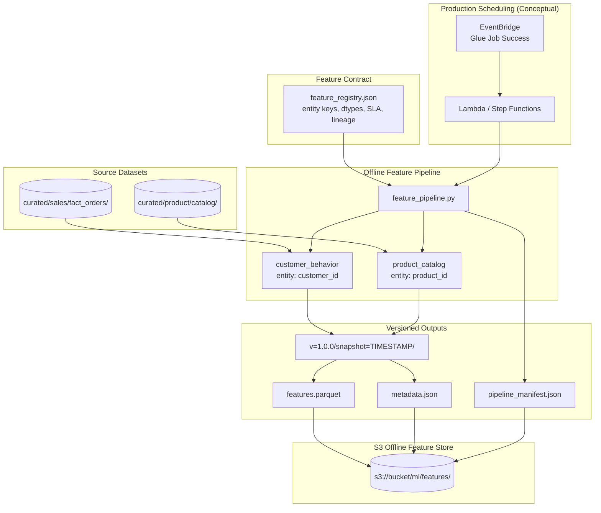
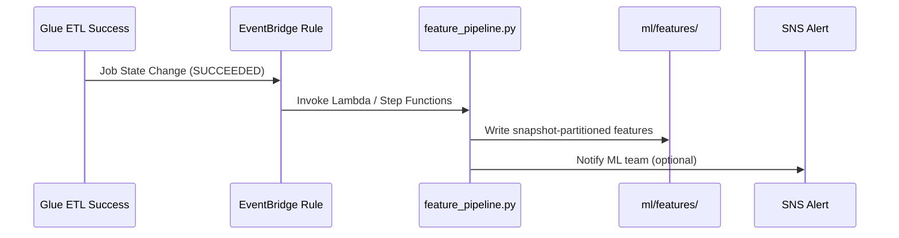

# Lab 9.2 Architecture: Feature Store Pipeline

Versioned feature groups defined in a registry, computed by an offline pipeline, and stored in S3 with snapshot partitions—mapping to SageMaker Feature Store patterns for production ML platforms.

---

## Architecture Diagram



---

## Key Components

| Component | Artifact / Path | Role in Lab |
|-----------|-----------------|-------------|
| Feature Registry | `src/feature_registry.json` | Contract between data engineering and ML teams |
| Feature Pipeline | `src/feature_pipeline.py` | Computes and writes feature groups |
| Customer Behavior Group | `ml/features/customer_behavior/` | Entity: `customer_id`; behavioral aggregates |
| Product Catalog Group | `ml/features/product_catalog/` | Entity: `product_id`; catalog attributes |
| Version Path | `v=1.0.0/snapshot=YYYYMMDDTHHMMSSZ/` | Immutable snapshot partitions |
| Feature Parquet | `features.parquet` | Columnar offline store format |
| Group Metadata | `metadata.json` | Row count, schema, computation timestamp |
| Pipeline Manifest | `pipeline_manifest.json` | Run summary linking all feature groups |
| S3 Offline Store | `s3://bucket/ml/features/` | Durable feature storage for batch training |
| EventBridge Trigger | Conceptual (Step 5) | Runs pipeline after curated ETL succeeds |

---

## Data Flows

### Flow 1: Registry → Pipeline → Offline Store

| Step | Component | Action |
|------|-----------|--------|
| 1 | Registry | Defines entity key, feature names, dtypes, freshness SLA |
| 2 | Pipeline | Reads curated source datasets |
| 3 | Pipeline | Computes features per entity at snapshot timestamp |
| 4 | Pipeline | Writes `features.parquet` + `metadata.json` under version path |
| 5 | Pipeline | Updates `pipeline_manifest.json` with group paths and stats |
| 6 | Student | `aws s3 sync` to `ml/features/` |

### Flow 2: Feature Group Layout

```text
ml/features/
├── customer_behavior/v=1.0.0/snapshot=20250529T120000Z/
│   ├── features.parquet      # entity_id + features + feature_snapshot_ts
│   └── metadata.json
├── product_catalog/v=1.0.0/snapshot=20250529T120000Z/
│   ├── features.parquet
│   └── metadata.json
└── pipeline_manifest.json
```

### Flow 3: Production Scheduling (Conceptual)



---

## SageMaker Feature Store Mapping

| Course Pattern | SageMaker Equivalent |
|----------------|---------------------|
| `feature_registry.json` | Feature group API definition |
| `ml/features/` Parquet | Offline store (S3) |
| `metadata.json` per run | Record ingestion metadata |
| Entity key column | Record identifier |
| `feature_snapshot_ts` | Event time for point-in-time joins |
| DynamoDB (not in lab) | Online store for real-time inference |

---

## Idempotency and Freshness

| Concern | Design |
|---------|--------|
| Overwrite collisions | New `snapshot=` path per run |
| Staleness | Registry defines freshness SLA per group |
| Training/serving skew | Single registry = single feature definition |
| Backfill | Re-run with historical `--snapshot` flag |

---

## Schema Requirements (Validation)

Every feature group output must include:

- Entity key column (`customer_id` or `product_id`)
- `feature_snapshot_ts` — event time for point-in-time queries
- `feature_version` — matches registry version (e.g., `1.0.0`)
