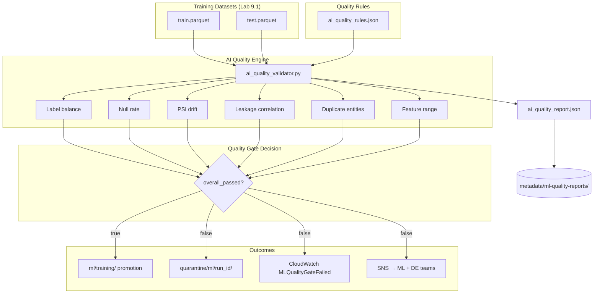
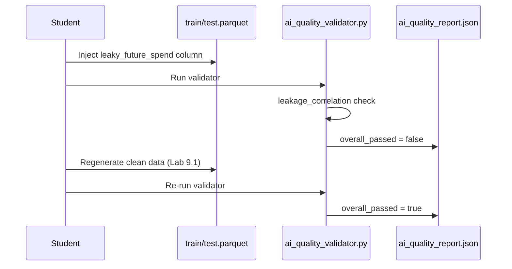
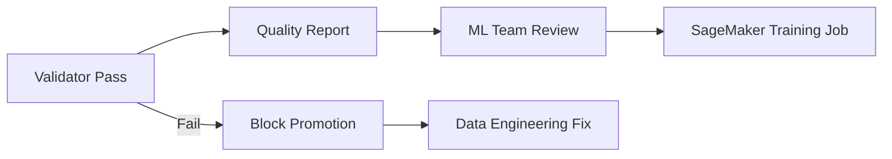

# Lab 9.3 Architecture: AI Data Quality Validation

ML-specific quality gates validate training datasets for label imbalance, feature drift (PSI), leakage, and schema integrity before promotion to the production ML training zone.

---

## Architecture Diagram



---

## Key Components

| Component | Artifact / Path | Role in Lab |
|-----------|-----------------|-------------|
| Training Data | Lab 9.1 `output/train.parquet`, `test.parquet` | Datasets under validation |
| Quality Rules | `src/ai_quality_rules.json` | Thresholds for each ML-specific check |
| Validator Script | `src/ai_quality_validator.py` | Runs checks, produces report |
| Quality Report | `output/ai_quality_report.json` | Pass/fail summary with per-check detail |
| Label Balance Check | Rules + validator | Detects class imbalance breaking classifiers |
| PSI Drift Check | Rules + validator | Population Stability Index: train vs test |
| Leakage Check | Rules + validator | Correlation between features and label |
| Quality Gate Design | `quality-gate-design.md` | Pipeline integration spec |
| S3 Report Archive | `metadata/ml-quality-reports/` | Auditable quality history |
| Module 4 Baseline | Quality framework | Traditional completeness/uniqueness extended for ML |

---

## Data Flows

### Flow 1: Validation Run

| Step | Check | Input | Pass Criteria |
|------|-------|-------|---------------|
| 1 | Label balance | train.parquet | Positive rate within min/max bounds |
| 2 | Null rate | train + test | Feature null % below threshold |
| 3 | PSI drift | train vs test | PSI < threshold per numeric feature |
| 4 | Leakage correlation | features vs label | \|correlation\| < max_abs_correlation |
| 5 | Duplicate entities | per snapshot | No duplicate customer_id + snapshot |
| 6 | Feature range | engineered features | Values within sanity bounds |

### Flow 2: Leakage Detection Exercise



### Flow 3: Pipeline Quality Gate (End-to-End)

| Step | Stage | Action |
|------|-------|--------|
| 1 | Curated ETL | Glue produces `curated/` tables |
| 2 | Feature Pipeline | Lab 9.2 writes `ml/features/` |
| 3 | ML Dataset Prep | Lab 9.1 produces train/val/test |
| 4 | AI Validator | Runs automatically post-prep |
| 5a | Pass | Sync to `ml/training/production/` |
| 5b | Fail | Write to `quarantine/ml/<run_id>/`; alert via SNS |

---

## Check Comparison: Module 4 vs Module 9

| Dimension | Module 4 (Traditional) | Module 9 (AI-Specific) |
|-----------|------------------------|------------------------|
| Completeness | Null checks on raw fields | Null rate impact on imputation |
| Uniqueness | Primary key uniqueness | Duplicate entities per snapshot |
| Range | Business rule bounds | Engineered feature sanity |
| — | — | Label class balance |
| — | — | PSI train/test drift |
| — | — | Leakage correlation audit |

---

## Quality Report Structure

```json
{
  "overall_passed": true,
  "error_count": 0,
  "warning_count": 0,
  "checks": [
    { "name": "label_balance", "passed": true, "severity": "error" },
    { "name": "psi_drift", "passed": true, "severity": "warning" }
  ]
}
```

---

## Sign-off Workflow


