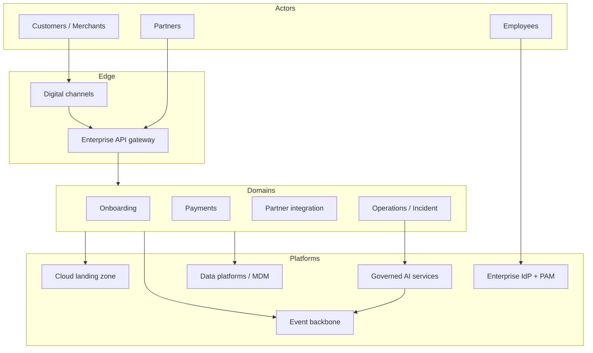

# Reference — Target Context Diagram (Instructor)

```mermaid
flowchart TB
  subgraph Actors
    CUST[Customers / Merchants]
    PART[Partners]
    EMP[Employees]
  end
  subgraph Edge
    CH[Digital channels]
    API[Enterprise API gateway]
  end
  subgraph Domains
    ONB[Onboarding]
    PAY[Payments]
    PARTN[Partner integration]
    OPS[Operations / Incident]
  end
  subgraph Platforms
    LZ[Cloud landing zone]
    EV[Event backbone]
    DATA[Data platforms / MDM]
    ID[Enterprise IdP + PAM]
    AI[Governed AI services]
  end
  CUST --> CH --> API
  PART --> API
  EMP --> ID
  API --> Domains
  Domains --> LZ
  Domains --> EV
  Domains --> DATA
  OPS --> AI
  AI --> EV
```
