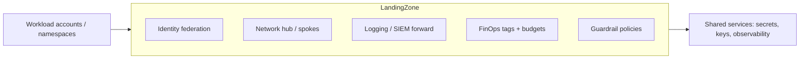

# Reference — Platform Landing Zone (Instructor)

```mermaid
flowchart LR
  subgraph LandingZone
    ID[Identity federation]
    NET[Network hub / spokes]
    LOG[Logging / SIEM forward]
    FIN[FinOps tags + budgets]
    SEC[Guardrail policies]
  end
  APP[Workload accounts / namespaces] --> LandingZone
  LandingZone --> SHR[Shared services: secrets, keys, observability]
```

**Calibration:** BU workloads consume LZ; they do not invent parallel identity/logging.
