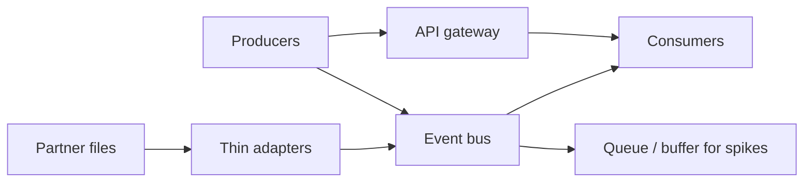

# Reference — Integration Backbone (Instructor)

```mermaid
flowchart LR
  P[Producers] --> API[API gateway]
  P --> EV[Event bus]
  API --> C[Consumers]
  EV --> C
  EV --> Q[Queue / buffer for spikes]
  F[Partner files] --> AD[Thin adapters] --> EV
```

**Calibration:** Reject new enterprise-wide custom frameworks; allow thin adapters.
