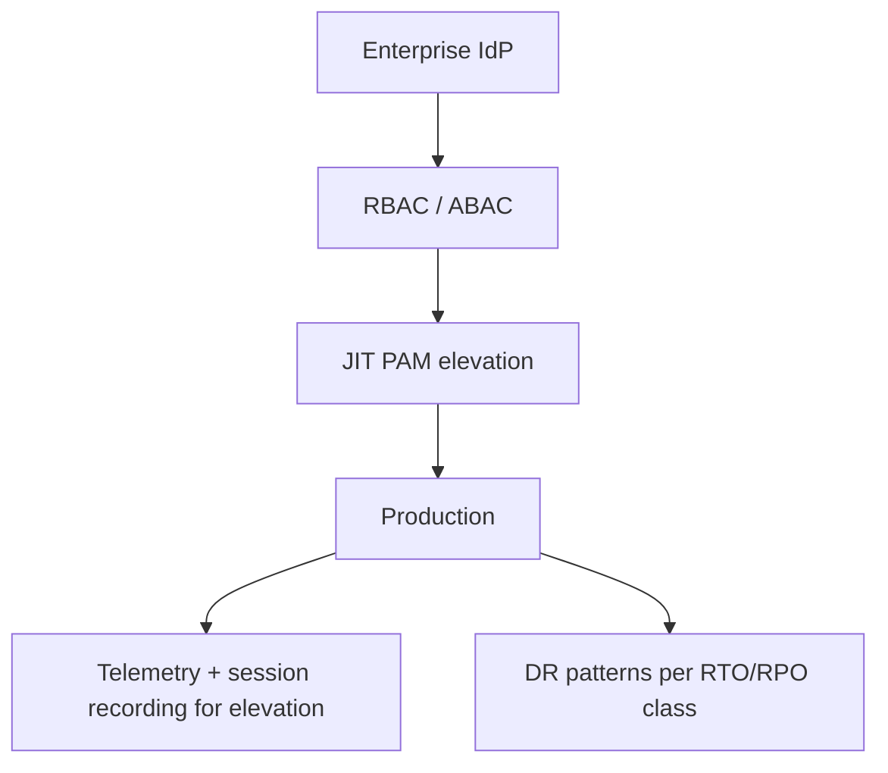

# Reference — Security & Resilience (Instructor)

```mermaid
flowchart TB
  ID[Enterprise IdP] --> RBAC[RBAC / ABAC]
  RBAC --> PAM[JIT PAM elevation]
  PAM --> PROD[Production]
  PROD --> OBS[Telemetry + session recording for elevation]
  PROD --> DR[DR patterns per RTO/RPO class]
```

**Calibration:** No standing contractor admin; CMEK for sensitive SoRs; tested recovery paths.
