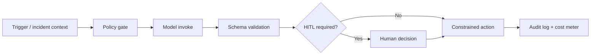

# Reference — Governed AI Path (Instructor)

```mermaid
flowchart LR
  T[Trigger / incident context] --> G[Policy gate]
  G --> M[Model invoke]
  M --> V[Schema validation]
  V --> H{HITL required?}
  H -->|Yes| HUM[Human decision]
  H -->|No| ACT[Constrained action]
  HUM --> ACT
  ACT --> A[Audit log + cost meter]
```

**Calibration:** Structured outputs, validation, HITL for high-impact actions, auditability.
