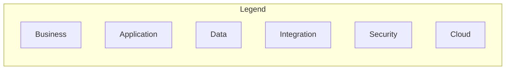

# Reusable Diagram Components

Shared building blocks for consistent BayLearn visuals. Import conceptually into Mermaid/Draw.io compositions.

## Color tokens

See [`../standards/VISUAL_STYLE_GUIDE.md`](../standards/VISUAL_STYLE_GUIDE.md). CSS variables for SVG templates:

```css
:root {
  --bl-navy: #232F3E;
  --bl-muted: #545B64;
  --bl-business: #E8F1FA;
  --bl-app: #F0F7E6;
  --bl-data: #FFF3E0;
  --bl-integration: #F3E8FF;
  --bl-security: #FCE8E6;
  --bl-cloud: #E6F2FF;
  --bl-ai: #EDE7F6;
  --bl-platform: #E0F7F5;
  --bl-gold: #C2A14D;
  --bl-critical: #D13212;
  --bl-warn: #ED7100;
  --bl-ok: #1D8102;
}
```

## Standard containers

| Component | Mermaid idiom | Draw.io |
| --------- | ------------- | ------- |
| AWS Cloud | `subgraph AWS["AWS Cloud"]` | AWS Cloud group |
| Region | `subgraph REG["Region"]` | Region group |
| Account | `subgraph ACC["Account: …"]` | Account frame |
| VPC | `subgraph VPC["VPC"]` | VPC frame |
| Public / Private subnet | nested subgraphs | AZ + subnet |
| Trust boundary | subgraph + red dashed stroke | Dashed security group |
| Human-in-the-loop | stadium node `HITL` | Decision + person |

## Legend (standard)



## Numbered step badge

Use `1`…`n` prefixes on edges or nodes: `A -->|1| B`.

## Fiction footer

NorthStar diagrams: include note `NorthStar Financial Services (fictional)`.

## Progressive reveal groups

Name Draw.io groups: `g1_actors`, `g2_edge`, `g3_compute`, `g4_data`, `g5_security`, `g6_observability` for PowerPoint animation order.
