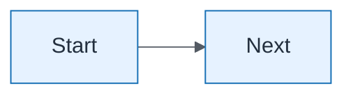

# Diagram template — Mermaid + metadata

```yaml
id: mXX-category-slug
title: Human readable title
category: concept|process|aws|sequence|infrastructure|dataflow|security|executive
module: module-XX
lesson: X.Y
lab: lab-XX
learningObjective: Students can …
awsIcons: [Amazon API Gateway, AWS Lambda]
```



Footer: NorthStar Financial Services (fictional) when case-specific.
