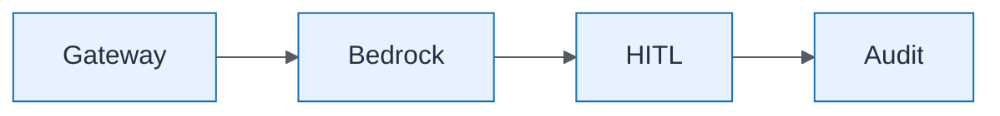

# AI Layer View

| Field | Value |
| ----- | ----- |
| ID | `cap-aws-ai-layer-view` |
| Category | `aws` |
| Module | `cap` |
| Lesson | — |
| Lab | lab-10 |
| Learning objective | Capstone integrated view: AI Layer View |
| AWS icons | Amazon API Gateway, Amazon Bedrock, AWS Organizations |

## Formats

- Mermaid: [`capstone/mermaid/aws/cap-aws-ai-layer-view.mmd`](capstone/mermaid/aws/cap-aws-ai-layer-view.mmd)
- Draw.io: [`capstone/drawio/aws/cap-aws-ai-layer-view.drawio`](capstone/drawio/aws/cap-aws-ai-layer-view.drawio)
- SVG: [`capstone/svg/aws/cap-aws-ai-layer-view.svg`](capstone/svg/aws/cap-aws-ai-layer-view.svg)
- PNG: [`capstone/png/aws/cap-aws-ai-layer-view.png`](capstone/png/aws/cap-aws-ai-layer-view.png)

## Mermaid

> Presentation masters for AWS reference architectures should be refined in Draw.io using official **AWS Architecture Icons** (AWS19/AWS23 stencil). Mermaid preserves structure and learning intent.
