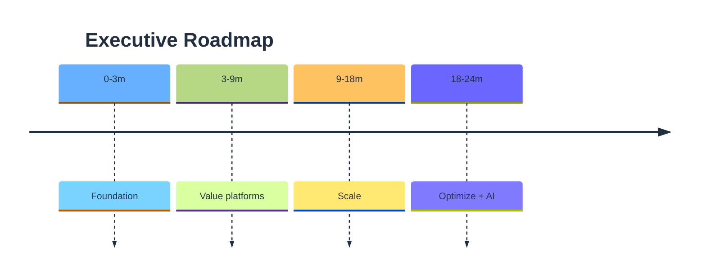

# Transformation Roadmap Exec

| Field | Value |
| ----- | ----- |
| ID | `cap-executive-transformation-roadmap-exec` |
| Category | `executive` |
| Module | `cap` |
| Lesson | — |
| Lab | lab-10 |
| Learning objective | Capstone integrated view: Transformation Roadmap Exec |
| AWS icons | _None (non-AWS concept)_ |

## Formats

- Mermaid: [`capstone/mermaid/executive/cap-executive-transformation-roadmap-exec.mmd`](capstone/mermaid/executive/cap-executive-transformation-roadmap-exec.mmd)
- Draw.io: [`capstone/drawio/executive/cap-executive-transformation-roadmap-exec.drawio`](capstone/drawio/executive/cap-executive-transformation-roadmap-exec.drawio)
- SVG: [`capstone/svg/executive/cap-executive-transformation-roadmap-exec.svg`](capstone/svg/executive/cap-executive-transformation-roadmap-exec.svg)
- PNG: [`capstone/png/executive/cap-executive-transformation-roadmap-exec.png`](capstone/png/executive/cap-executive-transformation-roadmap-exec.png)

## Mermaid

> Presentation masters for AWS reference architectures should be refined in Draw.io using official **AWS Architecture Icons** (AWS19/AWS23 stencil). Mermaid preserves structure and learning intent.
