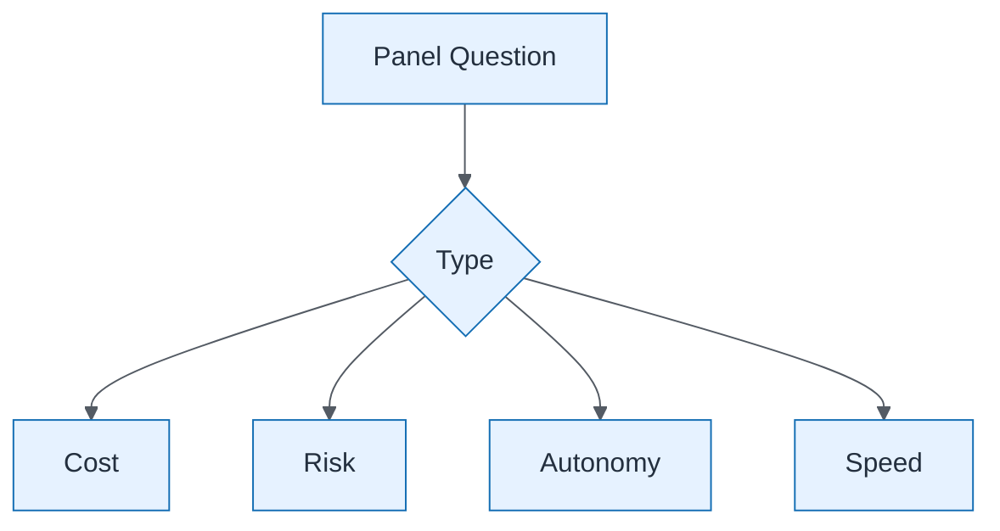

# Panel Q&A Defense Map

| Field | Value |
| ----- | ----- |
| ID | `cap-process-panel-q-a-defense-map` |
| Category | `process` |
| Module | `cap` |
| Lesson | — |
| Lab | lab-10 |
| Learning objective | Capstone integrated view: Panel Q&A Defense Map |
| AWS icons | _None (non-AWS concept)_ |

## Formats

- Mermaid: [`capstone/mermaid/process/cap-process-panel-q-a-defense-map.mmd`](capstone/mermaid/process/cap-process-panel-q-a-defense-map.mmd)
- Draw.io: [`capstone/drawio/process/cap-process-panel-q-a-defense-map.drawio`](capstone/drawio/process/cap-process-panel-q-a-defense-map.drawio)
- SVG: [`capstone/svg/process/cap-process-panel-q-a-defense-map.svg`](capstone/svg/process/cap-process-panel-q-a-defense-map.svg)
- PNG: [`capstone/png/process/cap-process-panel-q-a-defense-map.png`](capstone/png/process/cap-process-panel-q-a-defense-map.png)

## Mermaid

> Presentation masters for AWS reference architectures should be refined in Draw.io using official **AWS Architecture Icons** (AWS19/AWS23 stencil). Mermaid preserves structure and learning intent.
