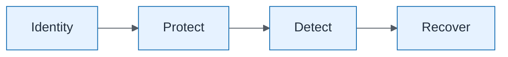

# Security Layer View

| Field | Value |
| ----- | ----- |
| ID | `cap-security-security-layer-view` |
| Category | `security` |
| Module | `cap` |
| Lesson | — |
| Lab | lab-10 |
| Learning objective | Capstone integrated view: Security Layer View |
| AWS icons | _None (non-AWS concept)_ |

## Formats

- Mermaid: [`capstone/mermaid/security/cap-security-security-layer-view.mmd`](capstone/mermaid/security/cap-security-security-layer-view.mmd)
- Draw.io: [`capstone/drawio/security/cap-security-security-layer-view.drawio`](capstone/drawio/security/cap-security-security-layer-view.drawio)
- SVG: [`capstone/svg/security/cap-security-security-layer-view.svg`](capstone/svg/security/cap-security-security-layer-view.svg)
- PNG: [`capstone/png/security/cap-security-security-layer-view.png`](capstone/png/security/cap-security-security-layer-view.png)

## Mermaid

> Presentation masters for AWS reference architectures should be refined in Draw.io using official **AWS Architecture Icons** (AWS19/AWS23 stencil). Mermaid preserves structure and learning intent.
