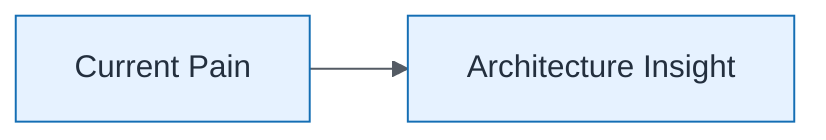

# Capability Mapping — Current State

| Field | Value |
| ----- | ----- |
| ID | `lab-02-concept-capability-mapping-current-state` |
| Category | `concept` |
| Module | `lab-02` |
| Lesson | — |
| Lab | lab-02 |
| Learning objective | Lab 2: Current State |
| AWS icons | _None (non-AWS concept)_ |

## Formats

- Mermaid: [`labs/lab-02/mermaid/concept/lab-02-concept-capability-mapping-current-state.mmd`](labs/lab-02/mermaid/concept/lab-02-concept-capability-mapping-current-state.mmd)
- Draw.io: [`labs/lab-02/drawio/concept/lab-02-concept-capability-mapping-current-state.drawio`](labs/lab-02/drawio/concept/lab-02-concept-capability-mapping-current-state.drawio)
- SVG: [`labs/lab-02/svg/concept/lab-02-concept-capability-mapping-current-state.svg`](labs/lab-02/svg/concept/lab-02-concept-capability-mapping-current-state.svg)
- PNG: [`labs/lab-02/png/concept/lab-02-concept-capability-mapping-current-state.png`](labs/lab-02/png/concept/lab-02-concept-capability-mapping-current-state.png)

## Mermaid

> Presentation masters for AWS reference architectures should be refined in Draw.io using official **AWS Architecture Icons** (AWS19/AWS23 stencil). Mermaid preserves structure and learning intent.
