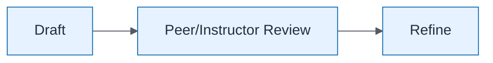

# Portfolio Assessment — Review Checkpoint

| Field | Value |
| ----- | ----- |
| ID | `lab-03-process-portfolio-assessment-review-checkpoint` |
| Category | `process` |
| Module | `lab-03` |
| Lesson | — |
| Lab | lab-03 |
| Learning objective | Lab 3: Review Checkpoint |
| AWS icons | _None (non-AWS concept)_ |

## Formats

- Mermaid: [`labs/lab-03/mermaid/process/lab-03-process-portfolio-assessment-review-checkpoint.mmd`](labs/lab-03/mermaid/process/lab-03-process-portfolio-assessment-review-checkpoint.mmd)
- Draw.io: [`labs/lab-03/drawio/process/lab-03-process-portfolio-assessment-review-checkpoint.drawio`](labs/lab-03/drawio/process/lab-03-process-portfolio-assessment-review-checkpoint.drawio)
- SVG: [`labs/lab-03/svg/process/lab-03-process-portfolio-assessment-review-checkpoint.svg`](labs/lab-03/svg/process/lab-03-process-portfolio-assessment-review-checkpoint.svg)
- PNG: [`labs/lab-03/png/process/lab-03-process-portfolio-assessment-review-checkpoint.png`](labs/lab-03/png/process/lab-03-process-portfolio-assessment-review-checkpoint.png)

## Mermaid

> Presentation masters for AWS reference architectures should be refined in Draw.io using official **AWS Architecture Icons** (AWS19/AWS23 stencil). Mermaid preserves structure and learning intent.
