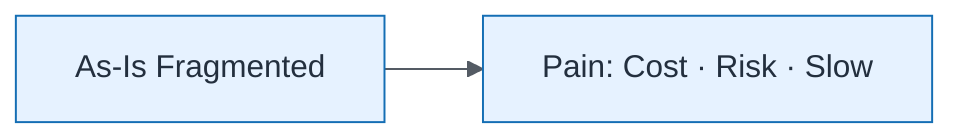

# Platform Foundation — Current Architecture

| Field | Value |
| ----- | ----- |
| ID | `lab-05-concept-platform-foundation-current-architecture` |
| Category | `concept` |
| Module | `lab-05` |
| Lesson | — |
| Lab | lab-05 |
| Learning objective | Lab 5 visual: Current Architecture |
| AWS icons | IAM, Amazon S3, AWS CloudTrail, Amazon CloudWatch, AWS Budgets, Amazon DynamoDB, AWS Lambda, Amazon API Gateway, AWS Systems Manager |

## Formats

- Mermaid: [`labs/lab-05/mermaid/concept/lab-05-concept-platform-foundation-current-architecture.mmd`](labs/lab-05/mermaid/concept/lab-05-concept-platform-foundation-current-architecture.mmd)
- Draw.io: [`labs/lab-05/drawio/concept/lab-05-concept-platform-foundation-current-architecture.drawio`](labs/lab-05/drawio/concept/lab-05-concept-platform-foundation-current-architecture.drawio)
- SVG: [`labs/lab-05/svg/concept/lab-05-concept-platform-foundation-current-architecture.svg`](labs/lab-05/svg/concept/lab-05-concept-platform-foundation-current-architecture.svg)
- PNG: [`labs/lab-05/png/concept/lab-05-concept-platform-foundation-current-architecture.png`](labs/lab-05/png/concept/lab-05-concept-platform-foundation-current-architecture.png)

## Mermaid

> Presentation masters for AWS reference architectures should be refined in Draw.io using official **AWS Architecture Icons** (AWS19/AWS23 stencil). Mermaid preserves structure and learning intent.
