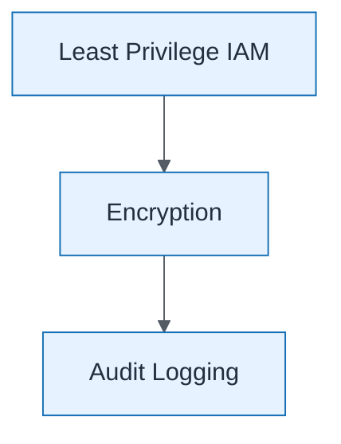

# Platform Foundation — Security

| Field | Value |
| ----- | ----- |
| ID | `lab-05-security-platform-foundation-security` |
| Category | `security` |
| Module | `lab-05` |
| Lesson | — |
| Lab | lab-05 |
| Learning objective | Lab 5 visual: Security |
| AWS icons | IAM, Amazon S3, AWS CloudTrail, Amazon CloudWatch, AWS Budgets, Amazon DynamoDB, AWS Lambda, Amazon API Gateway, AWS Systems Manager |

## Formats

- Mermaid: [`labs/lab-05/mermaid/security/lab-05-security-platform-foundation-security.mmd`](labs/lab-05/mermaid/security/lab-05-security-platform-foundation-security.mmd)
- Draw.io: [`labs/lab-05/drawio/security/lab-05-security-platform-foundation-security.drawio`](labs/lab-05/drawio/security/lab-05-security-platform-foundation-security.drawio)
- SVG: [`labs/lab-05/svg/security/lab-05-security-platform-foundation-security.svg`](labs/lab-05/svg/security/lab-05-security-platform-foundation-security.svg)
- PNG: [`labs/lab-05/png/security/lab-05-security-platform-foundation-security.png`](labs/lab-05/png/security/lab-05-security-platform-foundation-security.png)

## Mermaid

> Presentation masters for AWS reference architectures should be refined in Draw.io using official **AWS Architecture Icons** (AWS19/AWS23 stencil). Mermaid preserves structure and learning intent.
