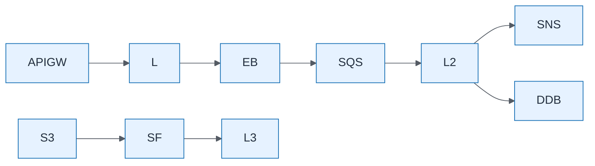

# Integration Platform — AWS Resources

| Field | Value |
| ----- | ----- |
| ID | `lab-06-aws-integration-platform-aws-resources` |
| Category | `aws` |
| Module | `lab-06` |
| Lesson | — |
| Lab | lab-06 |
| Learning objective | Lab 6 visual: AWS Resources |
| AWS icons | Amazon API Gateway, AWS Lambda, Amazon EventBridge, Amazon SQS, AWS Step Functions, Amazon S3, Amazon DynamoDB, Amazon SNS |

## Formats

- Mermaid: [`labs/lab-06/mermaid/aws/lab-06-aws-integration-platform-aws-resources.mmd`](labs/lab-06/mermaid/aws/lab-06-aws-integration-platform-aws-resources.mmd)
- Draw.io: [`labs/lab-06/drawio/aws/lab-06-aws-integration-platform-aws-resources.drawio`](labs/lab-06/drawio/aws/lab-06-aws-integration-platform-aws-resources.drawio)
- SVG: [`labs/lab-06/svg/aws/lab-06-aws-integration-platform-aws-resources.svg`](labs/lab-06/svg/aws/lab-06-aws-integration-platform-aws-resources.svg)
- PNG: [`labs/lab-06/png/aws/lab-06-aws-integration-platform-aws-resources.png`](labs/lab-06/png/aws/lab-06-aws-integration-platform-aws-resources.png)

## Mermaid

> Presentation masters for AWS reference architectures should be refined in Draw.io using official **AWS Architecture Icons** (AWS19/AWS23 stencil). Mermaid preserves structure and learning intent.
