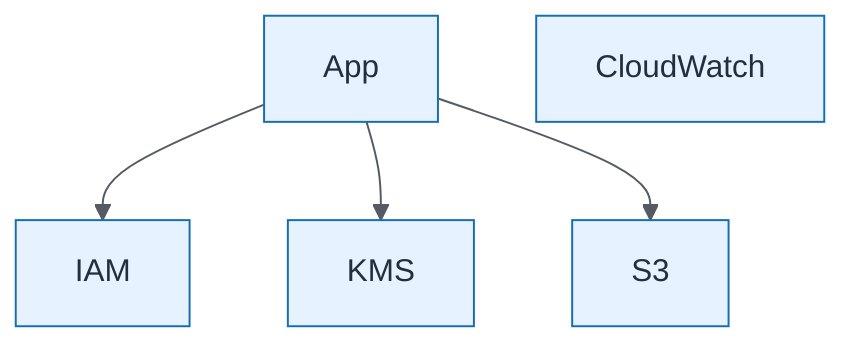

# Security Resilience — Expected Final Architecture

| Field | Value |
| ----- | ----- |
| ID | `lab-07-aws-security-resilience-expected-final-architecture` |
| Category | `aws` |
| Module | `lab-07` |
| Lesson | — |
| Lab | lab-07 |
| Learning objective | Lab 7 visual: Expected Final Architecture |
| AWS icons | IAM, AWS KMS, Amazon S3, Amazon CloudWatch |

## Formats

- Mermaid: [`labs/lab-07/mermaid/aws/lab-07-aws-security-resilience-expected-final-architecture.mmd`](labs/lab-07/mermaid/aws/lab-07-aws-security-resilience-expected-final-architecture.mmd)
- Draw.io: [`labs/lab-07/drawio/aws/lab-07-aws-security-resilience-expected-final-architecture.drawio`](labs/lab-07/drawio/aws/lab-07-aws-security-resilience-expected-final-architecture.drawio)
- SVG: [`labs/lab-07/svg/aws/lab-07-aws-security-resilience-expected-final-architecture.svg`](labs/lab-07/svg/aws/lab-07-aws-security-resilience-expected-final-architecture.svg)
- PNG: [`labs/lab-07/png/aws/lab-07-aws-security-resilience-expected-final-architecture.png`](labs/lab-07/png/aws/lab-07-aws-security-resilience-expected-final-architecture.png)

## Mermaid

> Presentation masters for AWS reference architectures should be refined in Draw.io using official **AWS Architecture Icons** (AWS19/AWS23 stencil). Mermaid preserves structure and learning intent.
