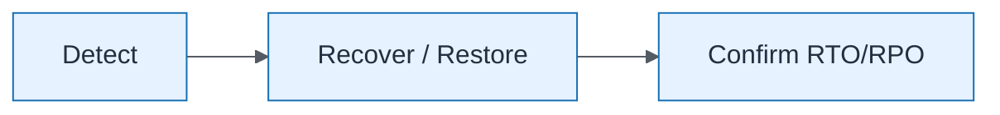

# Security Resilience — Recovery

| Field | Value |
| ----- | ----- |
| ID | `lab-07-process-security-resilience-recovery` |
| Category | `process` |
| Module | `lab-07` |
| Lesson | — |
| Lab | lab-07 |
| Learning objective | Lab 7 visual: Recovery |
| AWS icons | IAM, AWS KMS, Amazon S3, Amazon CloudWatch |

## Formats

- Mermaid: [`labs/lab-07/mermaid/process/lab-07-process-security-resilience-recovery.mmd`](labs/lab-07/mermaid/process/lab-07-process-security-resilience-recovery.mmd)
- Draw.io: [`labs/lab-07/drawio/process/lab-07-process-security-resilience-recovery.drawio`](labs/lab-07/drawio/process/lab-07-process-security-resilience-recovery.drawio)
- SVG: [`labs/lab-07/svg/process/lab-07-process-security-resilience-recovery.svg`](labs/lab-07/svg/process/lab-07-process-security-resilience-recovery.svg)
- PNG: [`labs/lab-07/png/process/lab-07-process-security-resilience-recovery.png`](labs/lab-07/png/process/lab-07-process-security-resilience-recovery.png)

## Mermaid

> Presentation masters for AWS reference architectures should be refined in Draw.io using official **AWS Architecture Icons** (AWS19/AWS23 stencil). Mermaid preserves structure and learning intent.
