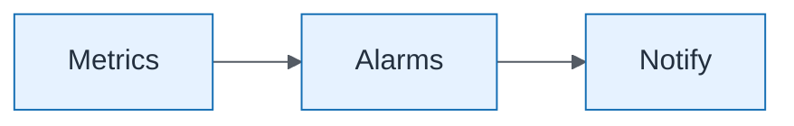

# AI Decision Assistant — Monitoring

| Field | Value |
| ----- | ----- |
| ID | `lab-08-infrastructure-ai-decision-assistant-monitoring` |
| Category | `infrastructure` |
| Module | `lab-08` |
| Lesson | — |
| Lab | lab-08 |
| Learning objective | Lab 8 visual: Monitoring |
| AWS icons | Amazon Bedrock, AWS Lambda, AWS Step Functions, Amazon DynamoDB, Amazon API Gateway, Amazon CloudWatch |

## Formats

- Mermaid: [`labs/lab-08/mermaid/infrastructure/lab-08-infrastructure-ai-decision-assistant-monitoring.mmd`](labs/lab-08/mermaid/infrastructure/lab-08-infrastructure-ai-decision-assistant-monitoring.mmd)
- Draw.io: [`labs/lab-08/drawio/infrastructure/lab-08-infrastructure-ai-decision-assistant-monitoring.drawio`](labs/lab-08/drawio/infrastructure/lab-08-infrastructure-ai-decision-assistant-monitoring.drawio)
- SVG: [`labs/lab-08/svg/infrastructure/lab-08-infrastructure-ai-decision-assistant-monitoring.svg`](labs/lab-08/svg/infrastructure/lab-08-infrastructure-ai-decision-assistant-monitoring.svg)
- PNG: [`labs/lab-08/png/infrastructure/lab-08-infrastructure-ai-decision-assistant-monitoring.png`](labs/lab-08/png/infrastructure/lab-08-infrastructure-ai-decision-assistant-monitoring.png)

## Mermaid

> Presentation masters for AWS reference architectures should be refined in Draw.io using official **AWS Architecture Icons** (AWS19/AWS23 stencil). Mermaid preserves structure and learning intent.
