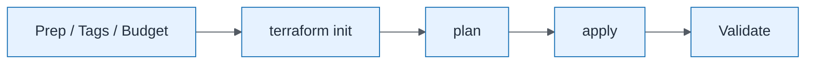

# AI Decision Assistant — Step by Step Deployment

| Field | Value |
| ----- | ----- |
| ID | `lab-08-process-ai-decision-assistant-step-by-step-deployment` |
| Category | `process` |
| Module | `lab-08` |
| Lesson | — |
| Lab | lab-08 |
| Learning objective | Lab 8 visual: Step by Step Deployment |
| AWS icons | Amazon Bedrock, AWS Lambda, AWS Step Functions, Amazon DynamoDB, Amazon API Gateway, Amazon CloudWatch |

## Formats

- Mermaid: [`labs/lab-08/mermaid/process/lab-08-process-ai-decision-assistant-step-by-step-deployment.mmd`](labs/lab-08/mermaid/process/lab-08-process-ai-decision-assistant-step-by-step-deployment.mmd)
- Draw.io: [`labs/lab-08/drawio/process/lab-08-process-ai-decision-assistant-step-by-step-deployment.drawio`](labs/lab-08/drawio/process/lab-08-process-ai-decision-assistant-step-by-step-deployment.drawio)
- SVG: [`labs/lab-08/svg/process/lab-08-process-ai-decision-assistant-step-by-step-deployment.svg`](labs/lab-08/svg/process/lab-08-process-ai-decision-assistant-step-by-step-deployment.svg)
- PNG: [`labs/lab-08/png/process/lab-08-process-ai-decision-assistant-step-by-step-deployment.png`](labs/lab-08/png/process/lab-08-process-ai-decision-assistant-step-by-step-deployment.png)

## Mermaid

> Presentation masters for AWS reference architectures should be refined in Draw.io using official **AWS Architecture Icons** (AWS19/AWS23 stencil). Mermaid preserves structure and learning intent.
