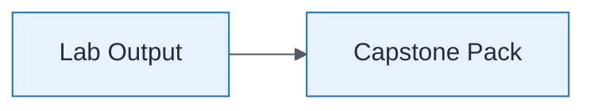

# Architecture Review Board — Capstone Contribution

| Field | Value |
| ----- | ----- |
| ID | `lab-09-executive-architecture-review-board-capstone-contribution` |
| Category | `executive` |
| Module | `lab-09` |
| Lesson | — |
| Lab | lab-09 |
| Learning objective | Lab 9: Capstone Contribution |
| AWS icons | _None (non-AWS concept)_ |

## Formats

- Mermaid: [`labs/lab-09/mermaid/executive/lab-09-executive-architecture-review-board-capstone-contribution.mmd`](labs/lab-09/mermaid/executive/lab-09-executive-architecture-review-board-capstone-contribution.mmd)
- Draw.io: [`labs/lab-09/drawio/executive/lab-09-executive-architecture-review-board-capstone-contribution.drawio`](labs/lab-09/drawio/executive/lab-09-executive-architecture-review-board-capstone-contribution.drawio)
- SVG: [`labs/lab-09/svg/executive/lab-09-executive-architecture-review-board-capstone-contribution.svg`](labs/lab-09/svg/executive/lab-09-executive-architecture-review-board-capstone-contribution.svg)
- PNG: [`labs/lab-09/png/executive/lab-09-executive-architecture-review-board-capstone-contribution.png`](labs/lab-09/png/executive/lab-09-executive-architecture-review-board-capstone-contribution.png)

## Mermaid

> Presentation masters for AWS reference architectures should be refined in Draw.io using official **AWS Architecture Icons** (AWS19/AWS23 stencil). Mermaid preserves structure and learning intent.
