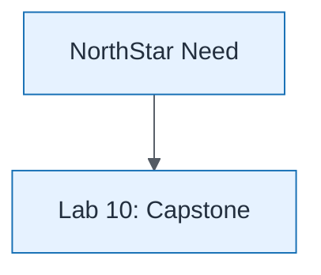

# Capstone — Business Context

| Field | Value |
| ----- | ----- |
| ID | `lab-10-concept-capstone-business-context` |
| Category | `concept` |
| Module | `lab-10` |
| Lesson | — |
| Lab | lab-10 |
| Learning objective | Lab 10: Business Context |
| AWS icons | _None (non-AWS concept)_ |

## Formats

- Mermaid: [`labs/lab-10/mermaid/concept/lab-10-concept-capstone-business-context.mmd`](labs/lab-10/mermaid/concept/lab-10-concept-capstone-business-context.mmd)
- Draw.io: [`labs/lab-10/drawio/concept/lab-10-concept-capstone-business-context.drawio`](labs/lab-10/drawio/concept/lab-10-concept-capstone-business-context.drawio)
- SVG: [`labs/lab-10/svg/concept/lab-10-concept-capstone-business-context.svg`](labs/lab-10/svg/concept/lab-10-concept-capstone-business-context.svg)
- PNG: [`labs/lab-10/png/concept/lab-10-concept-capstone-business-context.png`](labs/lab-10/png/concept/lab-10-concept-capstone-business-context.png)

## Mermaid

> Presentation masters for AWS reference architectures should be refined in Draw.io using official **AWS Architecture Icons** (AWS19/AWS23 stencil). Mermaid preserves structure and learning intent.
