# Architecture Layers Stack

| Field | Value |
| ----- | ----- |
| ID | `m01-concept-architecture-layers-stack` |
| Category | `concept` |
| Module | `module-01` |
| Lesson | 1.1 |
| Lab | — |
| Learning objective | Present layered enterprise view |
| AWS icons | _None (non-AWS concept)_ |

## Formats

- Mermaid: [`module-01/mermaid/concept/m01-concept-architecture-layers-stack.mmd`](module-01/mermaid/concept/m01-concept-architecture-layers-stack.mmd)
- Draw.io: [`module-01/drawio/concept/m01-concept-architecture-layers-stack.drawio`](module-01/drawio/concept/m01-concept-architecture-layers-stack.drawio)
- SVG: [`module-01/svg/concept/m01-concept-architecture-layers-stack.svg`](module-01/svg/concept/m01-concept-architecture-layers-stack.svg)
- PNG: [`module-01/png/concept/m01-concept-architecture-layers-stack.png`](module-01/png/concept/m01-concept-architecture-layers-stack.png)

## Mermaid

```mermaid
%%{init: {
  "theme": "base",
  "themeVariables": {
    "primaryColor": "#E6F2FF",
    "primaryTextColor": "#232F3E",
    "primaryBorderColor": "#146EB4",
    "lineColor": "#545B64",
    "secondaryColor": "#F0F7E6",
    "tertiaryColor": "#FFF3E0",
    "background": "#FFFFFF",
    "fontFamily": "Amazon Ember, Helvetica, Arial, sans-serif"
  }
}}%%
block-beta
  columns 1
  block:layers
    BUSINESS["Business Outcomes & Capabilities"]
    APP["Applications & Integration"]
    DATA["Data Products & MDM"]
    TECH["Cloud · Platform · Ops"]
    SEC["Security · Resilience · Compliance"]
  end
```

> Presentation masters for AWS reference architectures should be refined in Draw.io using official **AWS Architecture Icons** (AWS19/AWS23 stencil). Mermaid preserves structure and learning intent.
