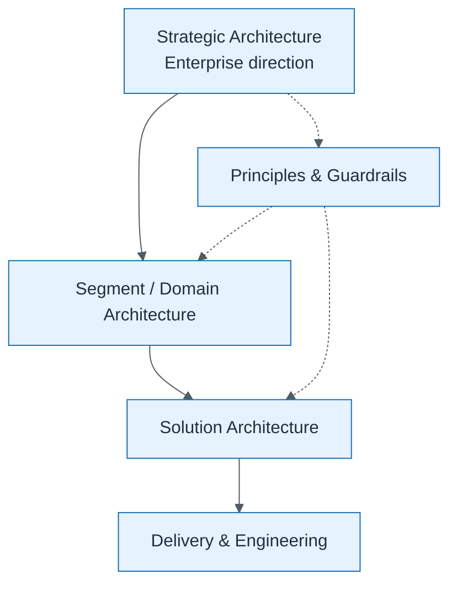

# Architecture Pyramid

| Field | Value |
| ----- | ----- |
| ID | `m01-concept-architecture-pyramid` |
| Category | `concept` |
| Module | `module-01` |
| Lesson | 1.1 |
| Lab | — |
| Learning objective | Distinguish strategic, segment, and solution architecture |
| AWS icons | _None (non-AWS concept)_ |

## Formats

- Mermaid: [`module-01/mermaid/concept/m01-concept-architecture-pyramid.mmd`](module-01/mermaid/concept/m01-concept-architecture-pyramid.mmd)
- Draw.io: [`module-01/drawio/concept/m01-concept-architecture-pyramid.drawio`](module-01/drawio/concept/m01-concept-architecture-pyramid.drawio)
- SVG: [`module-01/svg/concept/m01-concept-architecture-pyramid.svg`](module-01/svg/concept/m01-concept-architecture-pyramid.svg)
- PNG: [`module-01/png/concept/m01-concept-architecture-pyramid.png`](module-01/png/concept/m01-concept-architecture-pyramid.png)

## Mermaid

> Presentation masters for AWS reference architectures should be refined in Draw.io using official **AWS Architecture Icons** (AWS19/AWS23 stencil). Mermaid preserves structure and learning intent.
