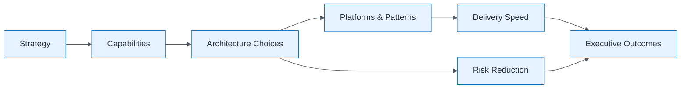

# Architecture Value Chain

| Field | Value |
| ----- | ----- |
| ID | `m01-executive-architecture-value-chain` |
| Category | `executive` |
| Module | `module-01` |
| Lesson | 1.4 |
| Lab | — |
| Learning objective | Tie EA work to measurable business value |
| AWS icons | _None (non-AWS concept)_ |

## Formats

- Mermaid: [`module-01/mermaid/executive/m01-executive-architecture-value-chain.mmd`](module-01/mermaid/executive/m01-executive-architecture-value-chain.mmd)
- Draw.io: [`module-01/drawio/executive/m01-executive-architecture-value-chain.drawio`](module-01/drawio/executive/m01-executive-architecture-value-chain.drawio)
- SVG: [`module-01/svg/executive/m01-executive-architecture-value-chain.svg`](module-01/svg/executive/m01-executive-architecture-value-chain.svg)
- PNG: [`module-01/png/executive/m01-executive-architecture-value-chain.png`](module-01/png/executive/m01-executive-architecture-value-chain.png)

## Mermaid

> Presentation masters for AWS reference architectures should be refined in Draw.io using official **AWS Architecture Icons** (AWS19/AWS23 stencil). Mermaid preserves structure and learning intent.
