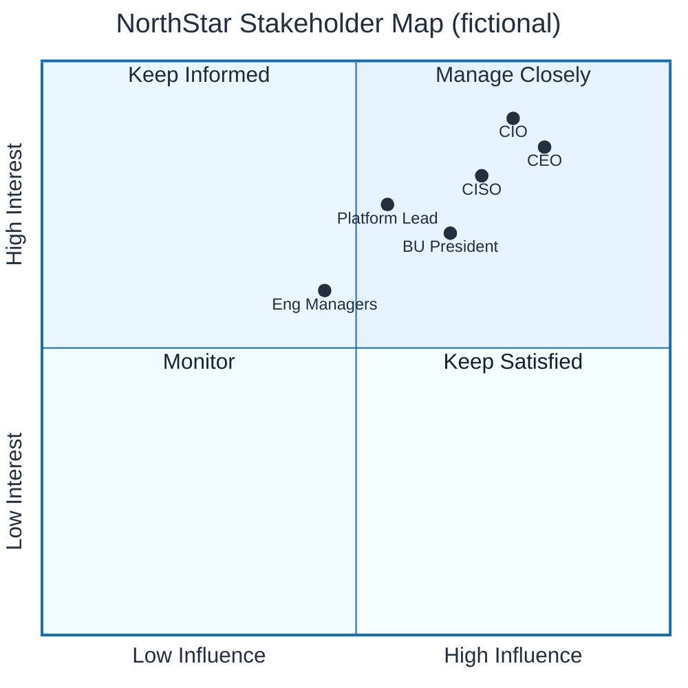

# Stakeholder Influence Map

| Field | Value |
| ----- | ----- |
| ID | `m01-executive-stakeholder-influence-map` |
| Category | `executive` |
| Module | `module-01` |
| Lesson | 1.4 |
| Lab | — |
| Learning objective | Position stakeholders by interest and influence |
| AWS icons | _None (non-AWS concept)_ |

## Formats

- Mermaid: [`module-01/mermaid/executive/m01-executive-stakeholder-influence-map.mmd`](module-01/mermaid/executive/m01-executive-stakeholder-influence-map.mmd)
- Draw.io: [`module-01/drawio/executive/m01-executive-stakeholder-influence-map.drawio`](module-01/drawio/executive/m01-executive-stakeholder-influence-map.drawio)
- SVG: [`module-01/svg/executive/m01-executive-stakeholder-influence-map.svg`](module-01/svg/executive/m01-executive-stakeholder-influence-map.svg)
- PNG: [`module-01/png/executive/m01-executive-stakeholder-influence-map.png`](module-01/png/executive/m01-executive-stakeholder-influence-map.png)

## Mermaid

> Presentation masters for AWS reference architectures should be refined in Draw.io using official **AWS Architecture Icons** (AWS19/AWS23 stencil). Mermaid preserves structure and learning intent.
