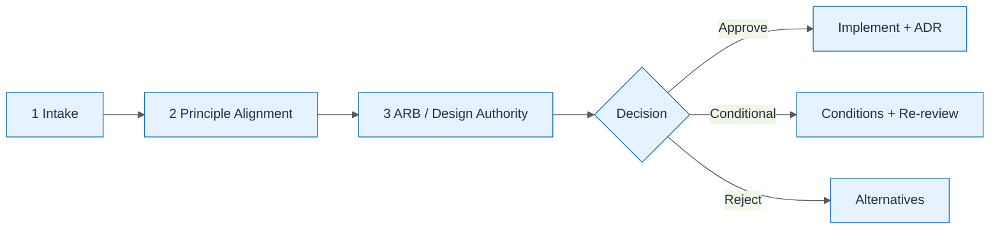

# Architecture Governance Flow

| Field | Value |
| ----- | ----- |
| ID | `m01-process-architecture-governance-flow` |
| Category | `process` |
| Module | `module-01` |
| Lesson | 1.2 |
| Lab | — |
| Learning objective | Describe how proposals move from intake to decision |
| AWS icons | _None (non-AWS concept)_ |

## Formats

- Mermaid: [`module-01/mermaid/process/m01-process-architecture-governance-flow.mmd`](module-01/mermaid/process/m01-process-architecture-governance-flow.mmd)
- Draw.io: [`module-01/drawio/process/m01-process-architecture-governance-flow.drawio`](module-01/drawio/process/m01-process-architecture-governance-flow.drawio)
- SVG: [`module-01/svg/process/m01-process-architecture-governance-flow.svg`](module-01/svg/process/m01-process-architecture-governance-flow.svg)
- PNG: [`module-01/png/process/m01-process-architecture-governance-flow.png`](module-01/png/process/m01-process-architecture-governance-flow.png)

## Mermaid

> Presentation masters for AWS reference architectures should be refined in Draw.io using official **AWS Architecture Icons** (AWS19/AWS23 stencil). Mermaid preserves structure and learning intent.
