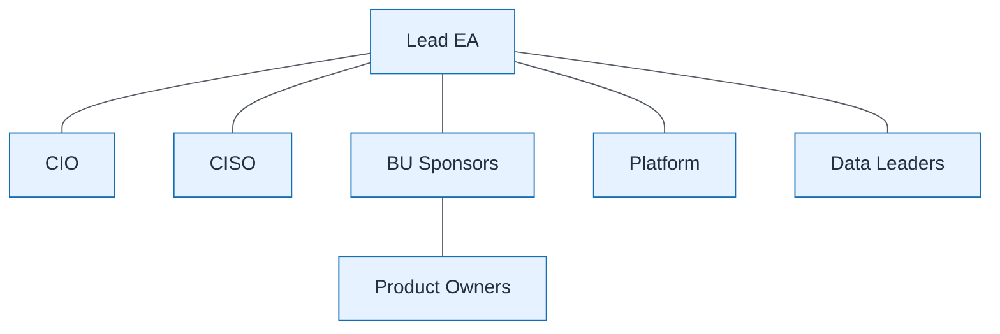

# Stakeholder Network

| Field | Value |
| ----- | ----- |
| ID | `m02-concept-stakeholder-network` |
| Category | `concept` |
| Module | `module-02` |
| Lesson | 2.4 |
| Lab | — |
| Learning objective | Apply business architecture visual: Stakeholder Network |
| AWS icons | _None (non-AWS concept)_ |

## Formats

- Mermaid: [`module-02/mermaid/concept/m02-concept-stakeholder-network.mmd`](module-02/mermaid/concept/m02-concept-stakeholder-network.mmd)
- Draw.io: [`module-02/drawio/concept/m02-concept-stakeholder-network.drawio`](module-02/drawio/concept/m02-concept-stakeholder-network.drawio)
- SVG: [`module-02/svg/concept/m02-concept-stakeholder-network.svg`](module-02/svg/concept/m02-concept-stakeholder-network.svg)
- PNG: [`module-02/png/concept/m02-concept-stakeholder-network.png`](module-02/png/concept/m02-concept-stakeholder-network.png)

## Mermaid

> Presentation masters for AWS reference architectures should be refined in Draw.io using official **AWS Architecture Icons** (AWS19/AWS23 stencil). Mermaid preserves structure and learning intent.
