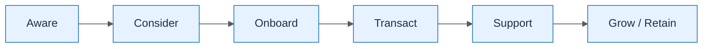

# Customer Journey Overlay

| Field | Value |
| ----- | ----- |
| ID | `m02-dataflow-customer-journey-overlay` |
| Category | `dataflow` |
| Module | `module-02` |
| Lesson | 2.3 |
| Lab | — |
| Learning objective | Apply business architecture visual: Customer Journey Overlay |
| AWS icons | _None (non-AWS concept)_ |

## Formats

- Mermaid: [`module-02/mermaid/dataflow/m02-dataflow-customer-journey-overlay.mmd`](module-02/mermaid/dataflow/m02-dataflow-customer-journey-overlay.mmd)
- Draw.io: [`module-02/drawio/dataflow/m02-dataflow-customer-journey-overlay.drawio`](module-02/drawio/dataflow/m02-dataflow-customer-journey-overlay.drawio)
- SVG: [`module-02/svg/dataflow/m02-dataflow-customer-journey-overlay.svg`](module-02/svg/dataflow/m02-dataflow-customer-journey-overlay.svg)
- PNG: [`module-02/png/dataflow/m02-dataflow-customer-journey-overlay.png`](module-02/png/dataflow/m02-dataflow-customer-journey-overlay.png)

## Mermaid

> Presentation masters for AWS reference architectures should be refined in Draw.io using official **AWS Architecture Icons** (AWS19/AWS23 stencil). Mermaid preserves structure and learning intent.
