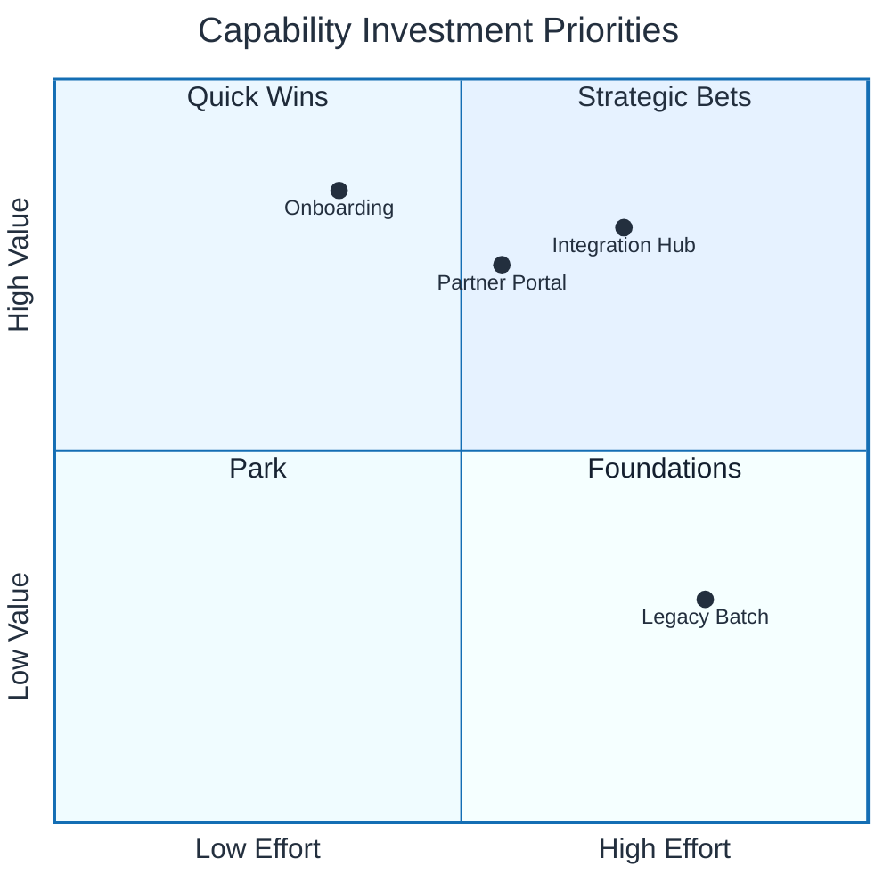

# Investment Priority Matrix

| Field | Value |
| ----- | ----- |
| ID | `m02-executive-investment-priority-matrix` |
| Category | `executive` |
| Module | `module-02` |
| Lesson | 2.4 |
| Lab | — |
| Learning objective | Apply business architecture visual: Investment Priority Matrix |
| AWS icons | _None (non-AWS concept)_ |

## Formats

- Mermaid: [`module-02/mermaid/executive/m02-executive-investment-priority-matrix.mmd`](module-02/mermaid/executive/m02-executive-investment-priority-matrix.mmd)
- Draw.io: [`module-02/drawio/executive/m02-executive-investment-priority-matrix.drawio`](module-02/drawio/executive/m02-executive-investment-priority-matrix.drawio)
- SVG: [`module-02/svg/executive/m02-executive-investment-priority-matrix.svg`](module-02/svg/executive/m02-executive-investment-priority-matrix.svg)
- PNG: [`module-02/png/executive/m02-executive-investment-priority-matrix.png`](module-02/png/executive/m02-executive-investment-priority-matrix.png)

## Mermaid

> Presentation masters for AWS reference architectures should be refined in Draw.io using official **AWS Architecture Icons** (AWS19/AWS23 stencil). Mermaid preserves structure and learning intent.
