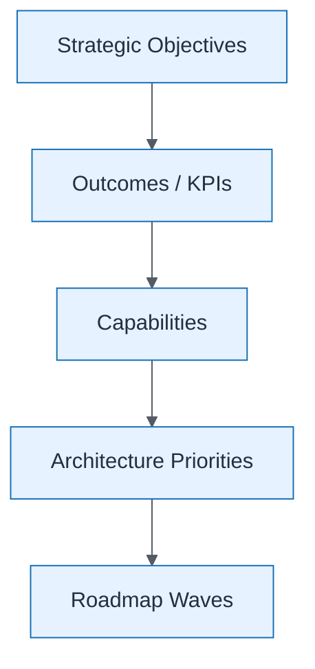

# Strategy to Architecture Cascade

| Field | Value |
| ----- | ----- |
| ID | `m02-process-strategy-to-architecture-cascade` |
| Category | `process` |
| Module | `module-02` |
| Lesson | 2.3 |
| Lab | — |
| Learning objective | Apply business architecture visual: Strategy to Architecture Cascade |
| AWS icons | _None (non-AWS concept)_ |

## Formats

- Mermaid: [`module-02/mermaid/process/m02-process-strategy-to-architecture-cascade.mmd`](module-02/mermaid/process/m02-process-strategy-to-architecture-cascade.mmd)
- Draw.io: [`module-02/drawio/process/m02-process-strategy-to-architecture-cascade.drawio`](module-02/drawio/process/m02-process-strategy-to-architecture-cascade.drawio)
- SVG: [`module-02/svg/process/m02-process-strategy-to-architecture-cascade.svg`](module-02/svg/process/m02-process-strategy-to-architecture-cascade.svg)
- PNG: [`module-02/png/process/m02-process-strategy-to-architecture-cascade.png`](module-02/png/process/m02-process-strategy-to-architecture-cascade.png)

## Mermaid

> Presentation masters for AWS reference architectures should be refined in Draw.io using official **AWS Architecture Icons** (AWS19/AWS23 stencil). Mermaid preserves structure and learning intent.
