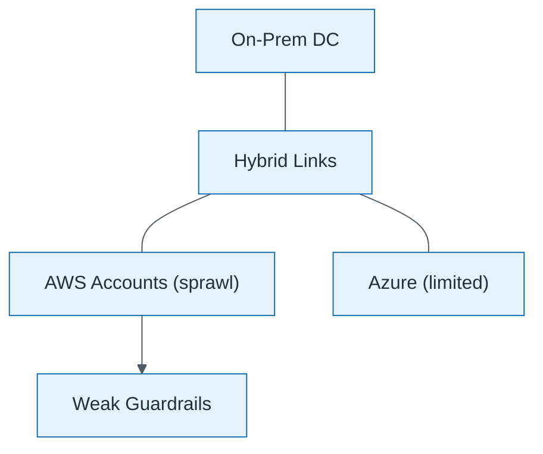

# Current Network Conceptual

| Field | Value |
| ----- | ----- |
| ID | `m03-infrastructure-current-network-conceptual` |
| Category | `infrastructure` |
| Module | `module-03` |
| Lesson | 3.4 |
| Lab | lab-03 |
| Learning objective | Assess current estate: Current Network Conceptual |
| AWS icons | _None (non-AWS concept)_ |

## Formats

- Mermaid: [`module-03/mermaid/infrastructure/m03-infrastructure-current-network-conceptual.mmd`](module-03/mermaid/infrastructure/m03-infrastructure-current-network-conceptual.mmd)
- Draw.io: [`module-03/drawio/infrastructure/m03-infrastructure-current-network-conceptual.drawio`](module-03/drawio/infrastructure/m03-infrastructure-current-network-conceptual.drawio)
- SVG: [`module-03/svg/infrastructure/m03-infrastructure-current-network-conceptual.svg`](module-03/svg/infrastructure/m03-infrastructure-current-network-conceptual.svg)
- PNG: [`module-03/png/infrastructure/m03-infrastructure-current-network-conceptual.png`](module-03/png/infrastructure/m03-infrastructure-current-network-conceptual.png)

## Mermaid

> Presentation masters for AWS reference architectures should be refined in Draw.io using official **AWS Architecture Icons** (AWS19/AWS23 stencil). Mermaid preserves structure and learning intent.
